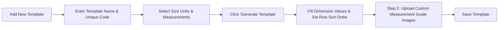

# Admin Management

Store administrators have full control over global size charts and oversight of marketplace seller size charts. All administration actions are accessible under the **Webkul > Marketplace Size Chart** backend menu.

---

## 1. Managing Size Units

Size units represent the standard garment and footwear sizes available in your catalog (e.g., `XS`, `S`, `M`, `L`, `XL`, `XXL`, or numeric standards like `38`, `40`, `42`).

### Size Units Listing Grid
Navigate to **Webkul > Marketplace Size Chart > Size Units** to view and manage existing global size units.

### Step-by-Step: Adding a New Size Unit

1. Navigate to **Webkul > Marketplace Size Chart > Size Units**.
2. Click **Add Unit** in the top-right toolbar.
3. On the edit form:
   - **Size Unit:** Enter the unit label (alphanumeric, e.g. `S`, `M`, `L`, `XL`, or numeric sizes like `42`).
   - **Status:** Set to `Enable` or `Disable`.

4. Click **Save Unit**.

### Grid Actions & Mass Operations
From the Size Units listing grid (`mpsizeunits_listing`), administrators can:
- Filter and search by `Entity Id`, `Size Unit`, `Status`, `Creation Time`, and `Update Time`.
- Execute **Mass Delete** to remove selected units.
- Execute **Mass Status** to toggle multiple units to `Enable` or `Disable` simultaneously.

---

## 2. Managing Body Measurements

Body measurements define the anatomical dimensions required to determine product fit (e.g., `Chest`, `Waist`, `Hips`, `Shoulder Width`, `Sleeve Length`, `Length`, `Inseam`).

### Measurements Listing Grid
Navigate to **Webkul > Marketplace Size Chart > Measurements** to view and manage all configured body measurements.

### Step-by-Step: Adding a Measurement

1. Navigate to **Webkul > Marketplace Size Chart > Measurements**.
2. Click **Add Measurement** in the top-right toolbar.
3. Configure the following fields:
   - **Measurement:** Enter the measurement dimension name (e.g., `Length`, `Chest / Bust`, `Waist`).
   - **Status:** Set to `Enable`.
   - **Measurement Image:** Click **Upload** to attach an illustrative diagram showing customers where and how to measure this dimension on their body. Supported formats: `PNG`, `JPG`, `JPEG`, `GIF`.

4. Click **Save Measurement**.

::: tip Guide Images
Providing clear visual measurement diagrams is essential for the **Custom Size Chart** frontend tab, where the diagram dynamically updates as the buyer enters each dimension.
:::

---

## 3. Creating Size Chart Templates

A Size Chart Template combines selected size units and body measurements into a structured, editable matrix table.

### Size Chart Templates Listing Grid
Navigate to **Webkul > Marketplace Size Chart > Size Chart Templates** to view all configured templates.

### Step 1: Template Information & Matrix Generation

1. Navigate to **Webkul > Marketplace Size Chart > Size Chart Templates**.
2. Click **Add Template**.
3. In the **Template Information** tab:
   - **Template Name:** Enter a descriptive title (e.g., *Child Shirt* or *Men's Slim Fit Shirts*).
   - **Template Code:** Enter a unique alphanumeric code without spaces (e.g., `s1` or `mens_slim_fit_shirts`). *(Note: Cannot be changed after creation)*.
   - **Status:** Set to `Enable`.

4. In the **Size Units** box, check the units to include in the chart (or click **Select All**).
5. In the **Body Measurements** box, check the required measurement parameters.

6. Click the **Generate Template** button:
   - A dynamic matrix grid will generate below.
   - Enter the corresponding numerical dimensions into each matrix cell (e.g., Size: S, Length: `20`).
   - Click **Edit Options** if you need to adjust the selected units or measurements.

### Step 2: Upload Measurements Image (Custom Chart)

1. Click **Upload Measurements image** in the left navigation tab (or the step indicator).
2. For each measurement included in the template:
   - Use the **Upload** button under **Image Uploader** to attach a guide diagram for this specific template.
   - The uploaded diagram will be previewed under the **Image Preview** column.

3. Click **Save Template** to persist the record.

---

## 4. Seller Menu Oversight

To maintain marketplace quality, administrators can review all size units, measurements, and templates created by marketplace sellers:

1. **Seller Size Units:**  
   Navigate to **Webkul > Marketplace Size Chart > Seller Menu > Size Units** (`mpsizecharttemplate/seller/sizeunits`). View all seller-owned size units with seller customer ID associations.

2. **Seller Measurements:**  
   Navigate to **Webkul > Marketplace Size Chart > Seller Menu > Measurements** (`mpsizecharttemplate/seller/measurements`). Inspect measurement definitions and uploaded diagrams submitted by sellers.

3. **Seller Size Chart Templates:**  
   Navigate to **Webkul > Marketplace Size Chart > Seller Menu > Size Chart Templates** (`mpsizecharttemplate/seller/templates`). Audit vendor size chart matrices before or after products go live.
