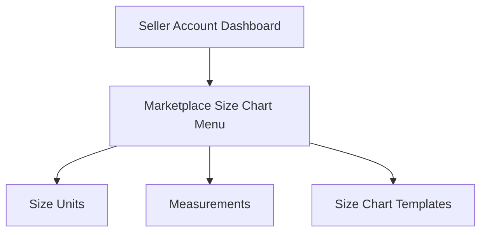
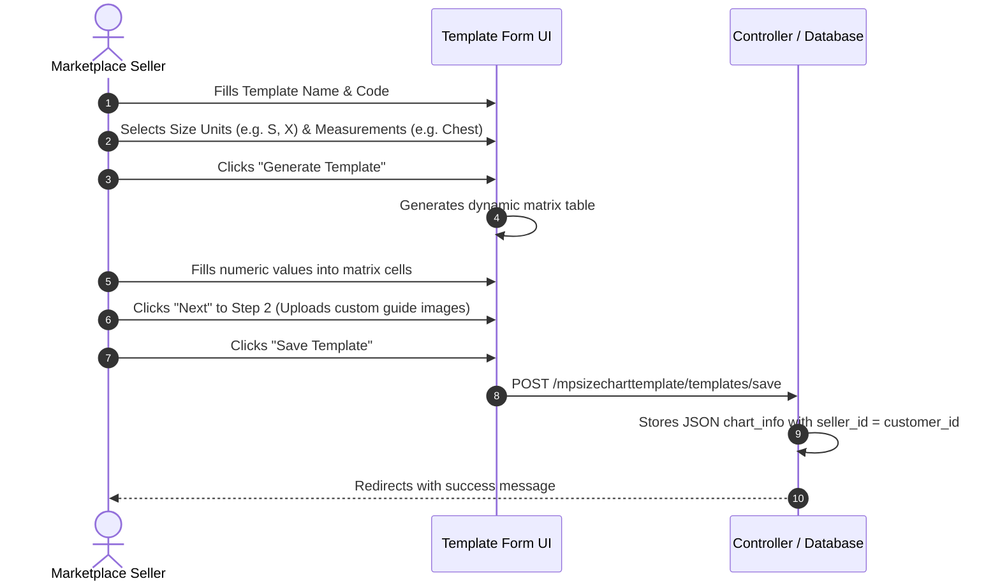

# Seller Management

Marketplace sellers can autonomously manage their own size standards, create body measurement instructions, and build size chart matrices directly from the Marketplace Seller Dashboard.

---

## Accessing the Seller Size Chart Menus

When a registered marketplace seller logs into their frontend customer account, a dedicated **Marketplace Size Chart** section appears in their navigation sidebar:

::: tip Seller Group Module Support
If the **Webkul Marketplace Seller Group** module is installed, store administrators can control which seller tiers or groups have permission to create and manage size charts via action-level ACL permissions.
:::

---

## 1. Managing Seller Size Units

Sellers can define brand-specific sizing units (such as US sizes, UK sizes, EU sizes, or custom alphanumeric sizes):

### Size Units Grid
Navigate to **Marketplace Size Chart > Size Units** in the seller sidebar to view all seller-owned size units.

### Step-by-Step: Adding a Size Unit
1. From the seller sidebar, click **Marketplace Size Chart > Size Units**.
2. Click **Add New** (or *Add Size Unit*).
3. Specify:
   - **Size Unit:** Enter the size identifier (e.g., `S`, `M`, `L`, `X`, `32`, `34`, `One Size`).
   - **Status:** Choose `Enable` or `Disable`.

4. Click **Save Unit**.

Sellers can also perform **Mass Delete** and **Mass Status Change** directly from their frontend listing grid using the **Actions** dropdown.

---

## 2. Managing Seller Measurements

Sellers can define measurement points for garments and upload customized measurement illustrations:

### Measurements Grid
Navigate to **Marketplace Size Chart > Measurements** to view all existing measurements.

### Step-by-Step: Adding a Measurement
1. Click **Marketplace Size Chart > Measurements**.
2. Click **Add New** (or *Add Measurement*).
3. Fill out the details:
   - **Measurement:** Enter the measurement name (e.g., `Chest`, `Waist`, `Inseam Length`, `Hip`).
   - **Status:** Set to `Enable` or `Disable`.
   - **Measurement Image:** Click **Upload** to attach an illustrative graphic showing customers how to take this measurement.

4. Click **Save Measurement**.

---

## 3. Building Seller Size Chart Templates

The multi-step template builder allows sellers to construct custom dimension matrices in minutes:

### Size Chart Templates Grid
Navigate to **Marketplace Size Chart > Size Chart Templates** to view and manage existing templates.

### Step 1: Matrix Configuration
1. In the seller dashboard, navigate to **Marketplace Size Chart > Size Chart Templates**.
2. Click **Add New** (or *Add Template*).
3. Fill in:
   - **Template Name:** Enter a recognizable name (e.g., *Men Casual Shirt Chart* or *Summer Dress Sizing*).
   - **Template Code:** Enter a unique alphanumeric code without spaces (e.g., `ms20` or `summer_dress_sizing`).
   - **Status:** Set to `Enable`.
4. Check the desired **Size Units** and **Body Measurements** (or use *Select All* / *Deselect All*).

5. Click **Generate Template**.
6. Enter the exact dimension values for each combination into the matrix table (e.g., Size: X, Chest: `98`).
7. Click **Edit Options** if you need to modify the selected units or measurements.

### Step 2: Custom Measurement Images
1. Advance to step 2 by clicking the step indicator or **Next**.
2. Under **Upload Measurements image**, use the **Upload** button to verify or replace the measurement guide diagrams for this template.

3. Click **Save Template** to persist the record.

---

## 4. Seller Data Isolation

All entities created by a seller are strictly isolated using their Magento customer ID:
- Sellers only view their own units, measurements, and templates.
- Attempts by other vendors to view or modify an unauthorized entity ID are automatically rejected.
- When creating or editing products, sellers only see their own active size chart templates in the product assignment dropdown.
