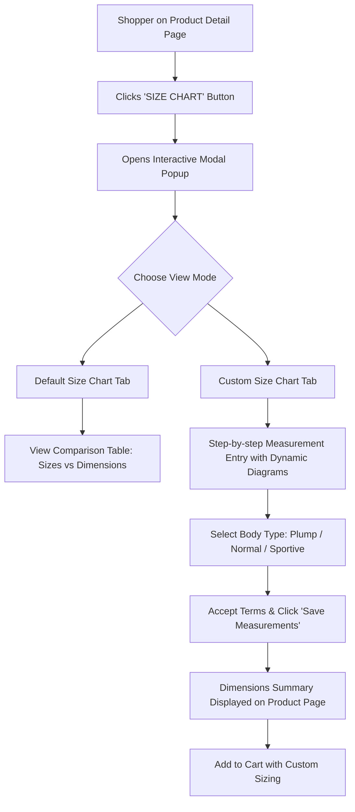
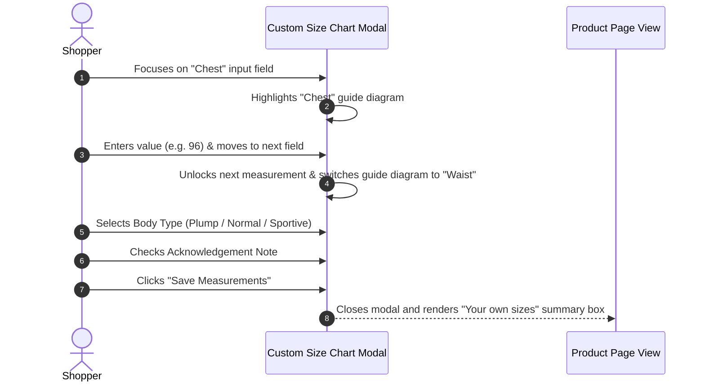
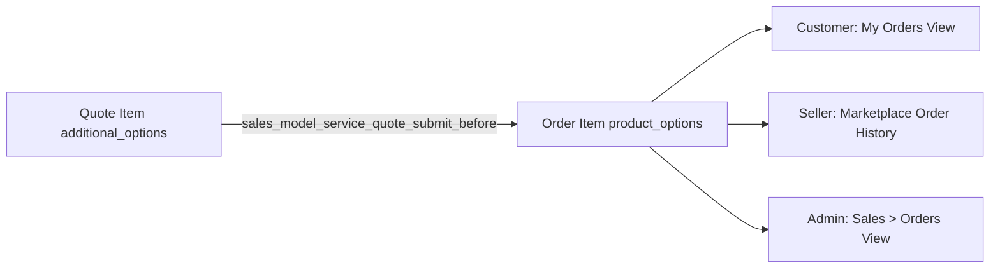

# Storefront & Custom Measurements

The **Marketplace Size Chart** extension provides a modern, responsive storefront experience that assists shoppers in selecting their correct size or submitting custom body measurements for tailored products.

---

## 1. Product Detail Page (PDP) Experience

When a customer visits a Simple or Configurable product with an assigned size chart template, an eye-catching **SIZE CHART** button appears next to the product options and add-to-cart area:

---

## 2. Modal View Modes

### Tab 1: Default Size Chart
Displays the full matrix comparison table generated by the admin or seller. Buyers can quickly compare standard sizes (e.g., Small, Medium, Large, X) against exact body dimensions (e.g., Chest: 38", Waist: 32", Length: 29").

---

### Tab 2: Custom Size Chart
If the size chart template contains measurement guide images, a second tab labeled **Custom Size Chart** is made available:

#### Key Custom Size Chart Features:

1. **Interactive Visual Guide Switching:**  
   As the buyer focuses on each measurement input field (e.g., *Chest*, *Waist*, *Inseam*), the visual diagram on the left automatically updates to show the exact measuring technique for that specific body part.
2. **Sequential Input Flow & Real-Time Validation:**  
   Fields unlock progressively as valid positive numerical measurements are entered.
3. **Body Type Selection:**  
   Customers select their body silhouette from three predefined radio choices:
   - **Plump**
   - **Normal**
   - **Sportive**
4. **Acknowledgement Checkbox:**  
   If configured by the admin, customers must confirm the terms disclaimer before submitting their measurements.
5. **Instructional Footer Note:**  
   Displays store guidance (e.g., *"PLEASE MAKE SURE TO TAKE THE CORRECT DIMENSIONS ACCORDING TO THE PROVIDED INSTRUCTIONS."*).

---

## 3. Saving Custom Measurements to the Cart

When the customer clicks **Save Measurements**:

1. The modal closes automatically.
2. A read-only summary container labeled **"Your own sizes"** appears directly above the Add to Cart button on the product page.
3. The custom dimensions are serialized into a hidden form payload (`product_customer_sizes`).
4. When the customer clicks **Add to Cart**, a Magento quote plugin (`Webkul\MpSizeChartTemplate\Plugin\Model\Quote`) intercepts the request and appends the custom sizes as `additional_options` on the Quote Item.

---

## 4. Order Processing & Visibility

Upon order placement, the extension executes event observers to guarantee that custom sizing is permanently stored and visible across all order management screens:

- **Customer Account View:** In **My Account > My Orders**, the customer can review their submitted custom measurements and body type alongside ordered items.
- **Seller Dashboard View:** In **Marketplace > My Order History**, marketplace sellers can view the exact measurements to fulfill custom tailoring orders accurately.
- **Admin Order View:** In **Sales > Orders > View Order**, store administrators can inspect the custom sizing details for production and quality control.
- **Multi-Shipping Support:** Custom dimensions are preserved across multi-address checkout orders via the `checkout_type_multishipping_create_orders_single` observer.
