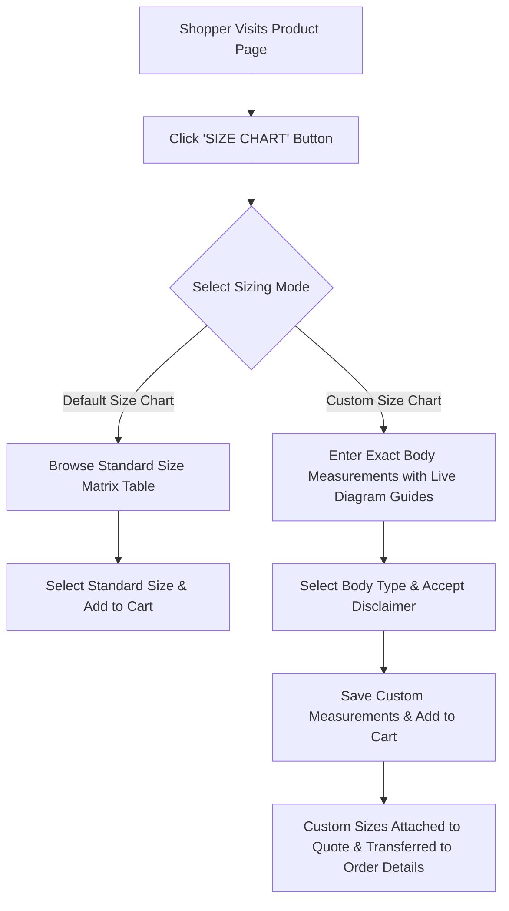

# Magento 2 Marketplace Size Chart

The **Webkul Magento 2 Marketplace Size Chart Template** extension enables store administrators and marketplace sellers to create, customize, and assign interactive size charts to catalog products. It provides a visual measurement guide and empowers shoppers to either browse standard size matrices or submit exact custom body measurements when purchasing apparel, footwear, and bespoke products.

This extension is built for multi-vendor marketplaces and e-commerce stores offering clothing, tailoring, uniforms, footwear, sportswear, or custom-fit accessories where accurate fitting information directly reduces product returns and boosts buyer confidence.

[Live Demo](https://mp-size-chart-template-marketplace-magento2.webkul.in/demomanagement/viewdemo/index/demoid/74/)  ·  [Buy Now](https://store.webkul.com/Marketplace-Product-Size-Chart-Magento2.html)  ·  [Support](https://webkul.uvdesk.com/)

---

## Two Ways to Work

Shoppers can choose between two sizing modes on the storefront:

- **Standard Size Matrix:** Shoppers view an interactive dimensions table comparing sizes (e.g., `S`, `M`, `L`, `XL`) against body parameters (`Chest`, `Waist`, `Length`).
- **Custom Shopper Measurements:** Shoppers enter their exact dimensions with live visual measuring diagrams, select their body type (`Plump`, `Normal`, `Sportive`), and order bespoke tailored items.

---

## Key Capabilities & Features

| Capability | Specification & Details |
|---|---|
| **Module Identification** | `Webkul_MpSizeChartTemplate` — Version `5.0.6` (`webkul/marketplace-size-chart`) |
| **Multi-Vendor Architecture** | Seamless separation of admin and seller entities: Admin manages global charts and inspects vendor charts, while sellers build and maintain their own size units, measurements, and templates. |
| **Size Units Management** | Create and toggle standard alphanumeric sizes (e.g., `XS`, `S`, `M`, `L`, `XL`, `XXL` or numeric sizes like `38`, `40`, `42`). |
| **Body Measurements with Visual Guides** | Define measurement parameters (e.g., `Chest`, `Waist`, `Hips`, `Shoulder`, `Inseam`) and upload visual guide diagrams to show buyers exactly how to measure. |
| **Dynamic Matrix Template Builder** | Multi-step interactive template generator that automatically combines selected size units and measurements into an editable matrix grid with custom row sort ordering. |
| **Dual Storefront Modal Tabs** | 1. **Default Size Chart:** Displays a responsive comparison matrix table comparing size units across all defined body measurements. 2. **Custom Size Chart:** An interactive measurement tool with live diagram switching as customers enter individual measurements. |
| **Body Type Selection** | Built-in customer body profile selectors: `Plump`, `Normal`, and `Sportive`. |
| **Custom Measurements Order Capture** | Customer-provided dimensions and body type selections are attached to quote items (`additional_options`) and transferred directly to order items (`product_options`) on checkout. |
| **Disclaimer & Acknowledgement** | Configurable acknowledgement checkbox note and uppercase footer disclaimer notes on custom size chart popups. |
| **Product Compatibility** | Supports both **Simple** and **Configurable** product types via the `wk_mpsizechart_template` EAV attribute. |
| **AJAX Live Preview** | Instant template rendering on backend product edit and seller product forms with real-time matrix loading. |
| **Marketplace Seller Group Integration** | Fully integrated with Webkul Marketplace Seller Group module to enforce role-based access control on size chart menus. |

---

## Where to Go Next

| Area | What it helps you do | Guide |
|---|---|---|
| **Requirements** | Check hosting, PHP, and Webkul Marketplace prerequisites. | [Open requirements](/requirements.html) |
| **Installation** | Add the extension via Composer or ZIP and run setup commands. | [Open installation](/installation.html) |
| **Activate & Connect** | Enable the module and customize disclaimer and footer notes. | [Open activation](/activation.html) |
| **Admin Management** | Configure global size units, measurements, and templates. | [Open admin guide](/configuration/admin-management.html) |
| **Seller Management** | Build seller-specific sizing units, measurements, and templates. | [Open seller guide](/configuration/seller-management.html) |
| **Product Setup** | Assign size chart templates to Simple and Configurable products. | [Open product setup](/configuration/product-category-setup.html) |
| **Storefront & Orders** | Explore PDP modals, custom sizing, and order processing. | [Open storefront guide](/configuration/storefront.html) |
| **Troubleshooting** | Resolve common setup questions and display issues. | [Open troubleshooting](/help/troubleshooting.html) |
| **FAQ** | Find answers to frequently asked questions. | [Open FAQ](/help/faq.html) |

---

## Quick Start

1. Check your environment in [Requirements](/requirements.html).
2. Complete the module setup in [Installation](/installation.html).
3. [Activate & Connect](/activation.html) — enable the module in backend settings and customize disclaimer notes.
4. Create [Size Units and Measurements](/configuration/admin-management.html) in the Admin Panel or Seller Dashboard.
5. Generate and save a [Size Chart Template](/configuration/admin-management.html).
6. Assign the template to your catalog products in [Product Setup](/configuration/product-category-setup.html).
7. Test the modal popup and custom measurement workflow on the [Storefront](/configuration/storefront.html).
8. If something looks off, consult the [Troubleshooting](/help/troubleshooting.html) guide.

