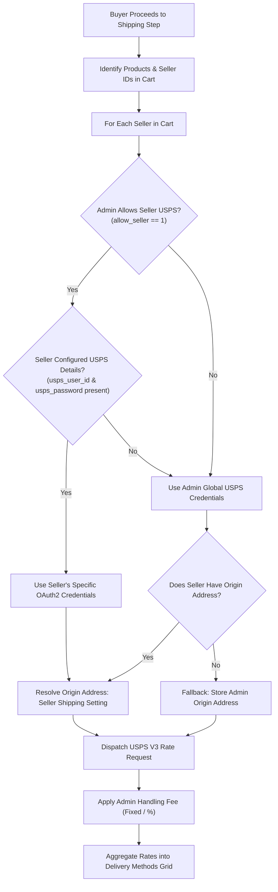

# Configuration Overview

The **Marketplace USPS Shipping** module operates on a hybrid dual-layer configuration model tailored specifically for multi-vendor marketplaces:

1. **Store Owner (Admin) Global Configuration:** Controls global carrier activation, default USPS V3 credentials, default payment account settings, allowable mail classes (domestic & international), processing categories, handling fees, package weight thresholds, and label generation policies.
2. **Seller-Level Configuration:** Empowers individual marketplace vendors to provide their own USPS Developer OAuth credentials and billing accounts, allowing shipping revenue and label generation fees to route directly through the seller's own USPS account.

---

## Configuration Hierarchy & Fallback Logic

When a customer initiates checkout with items from one or more sellers, the system evaluates credentials and origin addresses according to the following decision hierarchy:

---

## Key Configuration Areas

| Configuration Area | Location | Primary Purpose |
|---|---|---|
| **Admin Delivery Methods** | **Stores** &rarr; **Configuration** &rarr; **Sales** &rarr; **Delivery Methods** &rarr; **Marketplace USPS** | Enable carrier, set default OAuth credentials, select permitted mail classes, configure handling fee, define label parameters. |
| **Seller USPS Settings** | **Marketplace Dashboard** &rarr; **USPS Configuration** (`/mpusps/shipping/view`) | Enter vendor-specific Client ID, Client Secret, Payment Account Type (EPS/METER/PERMIT), Account Number, CRID, and MID. |
| **Seller Shipping Origin** | **Marketplace Dashboard** &rarr; **Shipping Setting** (`/marketplace/shipping/origin/`) | Define vendor's warehouse or store postal code, street address, city, state, and country used as origin for rate calculation. |
| **Seller PDF Header** | **Marketplace Dashboard** &rarr; **Manage Print PDF Header Info** (`/marketplace/order/printpdfheader/`) | Upload vendor logo, company address, and VAT/tax details for invoice and packing slips. |

::: important Seller Origin ZIP Code is Mandatory
The United States Postal Service requires a valid origin postal code to calculate zone-based domestic and international shipping rates. If a seller has not populated their postal code in **Shipping Setting**, USPS will not return rate quotes for that seller's products.
:::
