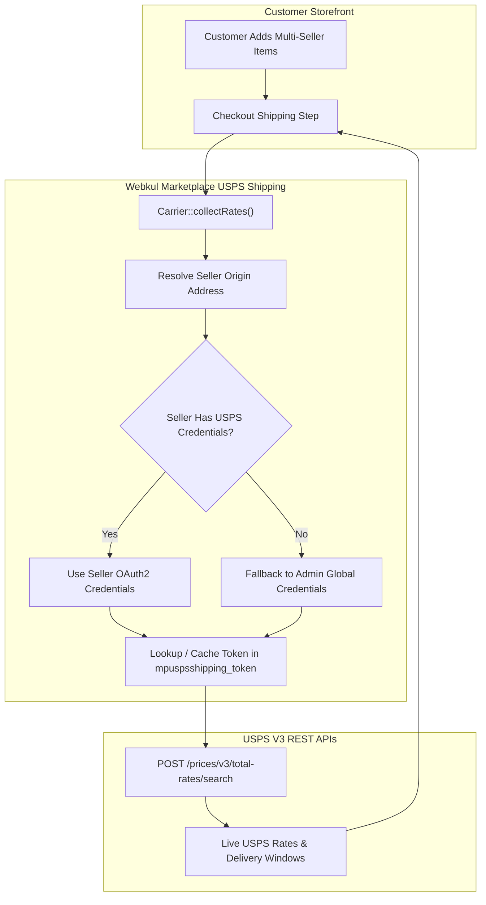

# Introduction

**Magento 2 Marketplace USPS Shipping** integrates the United States Postal Service (**USPS V3 REST APIs**) with Webkul's multi-vendor marketplace infrastructure for Magento 2. It allows marketplace store owners and independent sellers to provide real-time, accurate USPS shipping rate calculations at checkout and generate official USPS shipping labels directly from the seller portal.

In a standard Magento store, shipping rates are calculated from a single global origin address configured by the store administrator. In a multi-vendor marketplace, however, sellers ship from diverse locations across the country or around the world. Marketplace USPS Shipping solves this challenge by dynamically calculating live USPS rates based on each seller's unique shipping origin address and package weight.

---

## Core Architecture

The extension hooks into Magento's shipping carrier framework via `Webkul\MpUSPSShipping\Model\Carrier`, extending `Webkul\MarketplaceBaseShipping\Model\Carrier\AbstractCarrierOnline` under carrier code `marketplaceusps`.

---

## Key Highlights

### 1. Modern USPS V3 REST API Integration
The module utilizes the latest **USPS REST APIs (V3)** featuring OAuth 2.0 client credentials authentication (`POST /oauth2/v3/token`). It supports both the USPS Testing Environment for Mailers (**TEM / Development**: `https://apis-tem.usps.com`) and **Production (Live**: `https://apis.usps.com`).

### 2. Multi-Seller Origin Rate Calculation
Rates for each seller's items in the cart are calculated independently based on the seller's configured shipping origin (postal code, city, state, country) rather than a single warehouse location.

### 3. Seller Self-Service USPS Credentials
When permitted by admin (`Allow Sellers to Save USPS Details`), sellers can input their own USPS Developer Client ID, Client Secret, Payment Account Number (EPS, Meter, or Permit), Mailer Identifier (MID), and Customer Registration Identifier (CRID) in their vendor dashboard.

### 4. Resilient Fallback to Store Owner Credentials
If a seller has not provided USPS credentials, or if the admin disables seller credential management, the carrier automatically falls back to the administrator's global USPS credentials to prevent checkout disruption.

### 5. Automated Token Management
USPS OAuth2 access tokens are cached in the database table `mpuspsshipping_token` keyed by seller ID and scope. Tokens are automatically refreshed before expiration with a 5-second buffer window, avoiding redundant API authentication requests on every rate calculation.

### 6. Packaging Modal & PDF Shipping Labels
Sellers and admins can create official USPS shipping labels directly from order management. The built-in packaging modal allows selection of USPS container types, package dimensions, weights, and international export customs declarations (AESITN). Generated labels are saved in `marketplace_orders.shipment_label` and downloaded as printable PDF files.

### 7. Hyvä Theme Compatibility
Out-of-the-box compatibility with the modern Hyvä storefront theme is available via the companion extension `Webkul_MpUSPSShippingHyva`, providing native Alpine.js and Tailwind CSS implementations for checkout and seller dashboard workflows.
