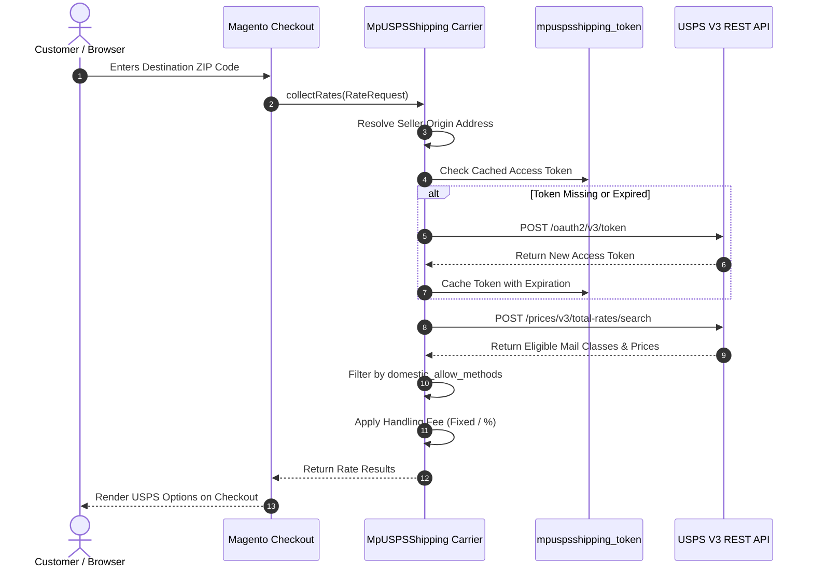

# Storefront Rate Calculation

When a customer navigates through checkout or views shipping estimates in the shopping cart, the **Marketplace USPS Shipping** carrier dynamically queries the USPS V3 Prices API to return live shipping quotes.

---

## The Checkout Experience

### 1. Estimating Shipping in Cart & Checkout
As soon as the customer provides their shipping address (destination country, state, and postal code), Magento requests rates from all enabled carriers.

Each permitted USPS mail class (such as **USPS Ground Advantage**, **Priority Mail**, or **Priority Mail International**) appears under the carrier title defined in admin configuration (e.g., `Marketplace USPS`).

### 2. Multi-Seller Split Calculations
When a cart contains items from multiple vendors:
1. The carrier groups items by seller ID.
2. For each seller group, the origin address is resolved from that seller's **Shipping Setting**.
3. Total package weight for that seller's items is calculated.
4. Independent rate queries are dispatched to USPS for each package.
5. The shipping rates are combined according to the Marketplace Base Shipping rules.

### 3. Order Review & Confirmation
After the customer selects their preferred USPS method, the chosen service and total shipping cost appear in the **Order Summary** sidebar on the payment step and the final order review page.

---

## Technical Rate Calculation Pipeline

The calculation flow operates in `Webkul\MpUSPSShipping\Model\Carrier::collectRates()`:

---

## Handling Fees & Price Adjustments

Store administrators can apply a markup to live carrier rates to cover handling, packaging materials, or warehouse fulfillment costs:

- **Fixed Fee Per Order:** Adds a flat surcharge once to the order (e.g., `$2.50` total).
- **Fixed Fee Per Package:** Multiplies the flat surcharge by the number of packages in the shipment.
- **Percent Fee:** Calculates a percentage markup based on the base USPS rate quote (e.g., `5%` markup).

Handling fees are seamlessly factored into the rate displayed to the customer.
