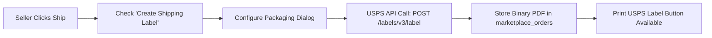

# Shipment & Label Generation

Both marketplace sellers (when permitted by admin) and store administrators can fulfill orders placed with Marketplace USPS Shipping, generate invoices, create packaging slips, and print official USPS shipping labels directly from the management interface.

---

## 1. Seller Order Management Workflow

When a customer completes an order with USPS shipping:

1. The seller navigates to **My Order History** in the vendor dashboard.
2. The seller locates the order in the grid and clicks **View Order**.

3. On the order detail page, the seller reviews the ordered line items, buyer shipping address, and chosen USPS method.

---

## 2. Generating the USPS Shipping Label

To create a shipment and print an official USPS label:

1. Click **Ship** or scroll to the shipment generation section.
2. Check the **Create Shipping Label** checkbox.

3. Click **Submit Shipment**.
4. The Magento packaging popup opens:
   - **Container:** Select the USPS package container type (e.g., Variable Container, Flat Rate Envelope, Small Flat Rate Box, Medium Flat Rate Box, Large Flat Rate Box).
   - **Dimensions:** Specify package length, width, and height.
   - **Weight:** Confirm the total package weight.
   - **Customs Declaration (International):** For cross-border orders, input the customs description, item value, and export code (AESITN).
5. Click **Save** to confirm packaging.

6. The module transmits the shipment payload to the **USPS Labels API** (`/labels/v3/label`).
7. USPS returns the official binary shipping label PDF and tracking number.
8. The label is stored securely in the `marketplace_orders.shipment_label` database column.

---

## 3. Printing Shipping Labels & Slips

Once the shipment is created, several download and print options become available:

### Official USPS Shipping Label
Click **Print USPS Label** (route `/mpusps/shipment/printpdf/order_id/{id}/`) to view and download the official USPS shipping label containing the Intelligent Mail barcode, sender address, recipient address, and tracking number.

### Invoice & Packing Slips
Vendors can also print their branded invoices and packing slips featuring their custom header information:

---

## 4. Bulk Invoice & Packaging Slip Downloads

In **My Orders**, sellers can download multiple invoices and packing slips across date ranges:

1. Click **Download All Invoices** or **Download All Packaging Slips**.
2. Select the start and end dates in the modal dialog.
3. Click **Download** to obtain a consolidated PDF archive.

---

## 5. Admin-End Order Fulfillment

Store administrators can also manage orders and generate USPS labels for items fulfilled directly from store inventory:

1. In Magento Admin, go to **Sales** &rarr; **Orders**.
2. Select the order and click **View**.

3. Generate the invoice and shipment.

4. Create the shipment and print the shipping label or packaging slip.

