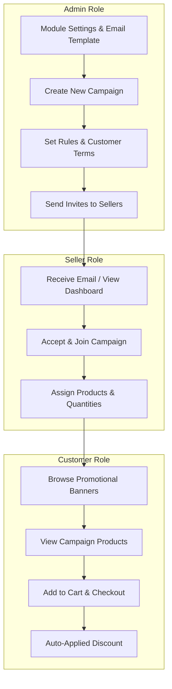

# Configuration Overview

The **Magento 2 Marketplace Campaign** workflow spans three distinct roles: the **Store Admin**, the **Marketplace Seller**, and the **Customer**.

---

### Navigation Summary

- **Admin Module Configuration**: `Stores > Configuration > Webkul > Marketplace Campaign`
- **Admin Campaign Manager**: `Marketplace Management > Manage Campaigns`
- **Admin Order Tracking**: `Marketplace Management > Campaign Orders`
- **Seller Panel**: `Marketplace Dashboard > Campaigns`
- **Customer Storefront**: `Offers / Campaign Banners`
