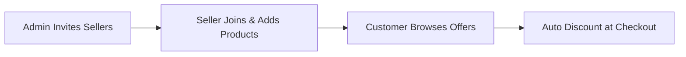

# Introduction

**Magento 2 Marketplace Campaign** extension is a performance-driven marketing module for Adobe Commerce. It helps store owners create, manage, and run targeted promotional campaigns across their multi-vendor marketplace with ease.

Store owners can design eye-catching banners, configure flexible promotional rules, set discount conditions, and invite marketplace sellers to participate.

::: tip Marketplace Add-on Requirement
This extension is an **add-on** to the **Adobe Commerce Multi-Vendor Marketplace**. To make use of this extension, you must have first installed Webkul's [Magento 2 Multi-Vendor Marketplace](https://store.webkul.com/magento2-multi-vendor-marketplace.html).
:::

### Key Features

- **Centralized Campaign Grid**: Admin can visualize, filter, and manage all campaign details in a unified grid.
- **Seller Participation**: Admin can allow/disallow seller participation and send campaign invitations via email.
- **Flexible Promotional Rules**: Supports percentage discount, fixed amount discount, cart-wide discount, and Buy X Get Y Free rules.
- **Seller Dashboard Integration**: Marketplace sellers can view allowed campaigns, accept invitations, and manage participating products.
- **Automated Customer Discounts**: Customers browse live campaign offers and receive auto-applied discounts at checkout.
- **Campaign Order Tracking**: Dedicated admin grid to track all orders generated through active campaigns.
- **Terms & Conditions**: Admin can configure custom terms and conditions for both sellers and customers.

---

### Video Tutorials

#### Backend Configuration Overview
Check out the backend campaign creation and module setup:

#### Storefront & Seller Workflow Overview
See how sellers join campaigns and customers redeem discounts:

