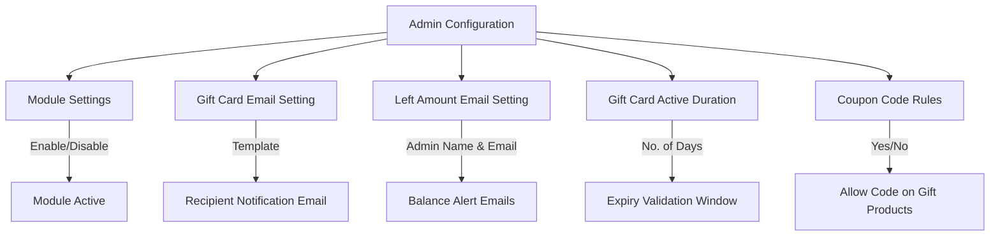

# Admin Configuration

After installing the extension, you must configure the backend settings to activate the module, setup email notification templates, specify admin notification contacts, and establish expiration limits.

Navigate to **Stores > Configuration > Webkul > Gift Card** in your Magento Admin Panel.

## Module License

The admin needs to verify the module license to use it properly. Navigate to **Stores > Configuration > Webkul > Module License**.

Here, the admin will find the list of all the licensed modules. For the Marketplace Gift Card module, the admin needs to enter the License Key and click on the **Save & Verify** button to verify the license.


---

## Configuration Settings Overview



---

## Detailed Setting Groups

### 1. Module Settings
- **Module Enable/Disable**: Select **Enable** to activate Gift Card functionality across the store and vendor panels. Select **Disable** to hide gift card options.


### 2. Gift Card Email Setting
- **Gift Notification Template**: Select the transaction email template sent to the gift recipient when a gift card is purchased. (Default: *Gift Notification Template*).


### 3. Left Amount Email Setting (Admin Balance Alerts)
- **Name of Admin in Mail**: Enter the sender display name used in balance update emails sent to customers and admins (e.g., `Store Manager`).
- **Admin Email**: Enter a valid admin email address (e.g., `admin@example.com`) to receive notifications whenever a gift card's balance is updated or partially redeemed.
- **Admin Left Amount Notification Template**: Select the transaction email template used for sending left amount alerts.


### 4. Gift Card Active Duration
- **No. of days**: Enter an integer value representing the number of days a gift card remains valid from its creation/issue date (e.g., `365` for 1 year validity).

> [!IMPORTANT]
> Once a gift card exceeds the configured active duration, it is marked as **Expired** and can no longer be redeemed at checkout.


### 5. Apply Gift Card Code On Gift Card Product
- **Allow Gift Card Code On Gift Card Product**:
  - **Yes**: Customers can pay for a new Gift Card product using an existing Gift Card code.
  - **No**: Gift Card codes cannot be applied to orders containing Gift Card products.


---

## Configuration Summary Table

| Field Name | Path in Admin | Description | Recommended Value |
| :--- | :--- | :--- | :--- |
| **Module Enable/Disable** | `mpgiftcard/modulesettings/enable` | Enable or disable the extension globally | Enable |
| **Gift Notification Template** | `mpgiftcard/email/gift_notification_mail` | Transactional email template sent to recipient | Webkul Gift Card Template |
| **Name of Admin in Mail** | `mpgiftcard/adminEmail/gift_admin_mail_name` | Admin display name in emails | Store Administrator |
| **Admin Email** | `mpgiftcard/adminEmail/gift_admin_mail_email` | Receives copy of balance updates | admin@yourdomain.com |
| **Admin Left Amount Template** | `mpgiftcard/adminEmail/admin_amt_notification_mail` | Left amount notification template | Left Amount Alert Template |
| **No. of days** | `mpgiftcard/activeDuration/gift_admin_active_days` | Active lifetime of generated gift code | 365 |
| **Allow Code On Gift Product** | `mpgiftcard/applyGiftcardCpupon/...` | Allow gift cards to buy gift cards | No |

---

## Saving Configuration

After making adjustments, click **Save Config** in the top-right header and clear the Magento Cache:

```bash
php bin/magento cache:flush
```
<ExplainCode explanation="Clears all cached configuration and block data to apply the new admin settings immediately." />
