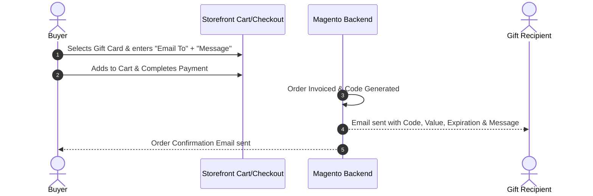
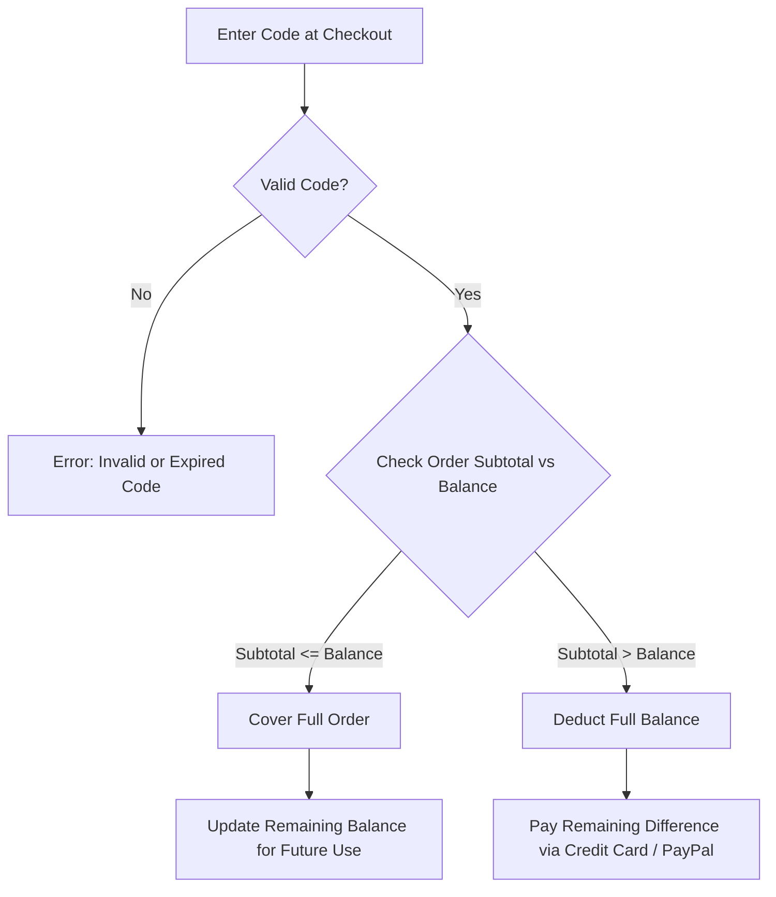
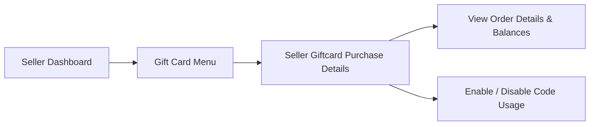

# Purchasing & Redeeming Gift Cards

This section details how customers purchase gift cards for recipients and how recipients redeem gift codes during store checkout.

---

## Purchasing Flow

1. **Selection**: Customer visits product page, selects gift card value, enters **Email To** (recipient's email address), and types a **Message**.

Hyvä Compatible Image

2. **Checkout**: Customer adds the gift card to cart and proceeds through payment checkout.

Hyvä Compatible Image

3. **Automated Generation**: Upon invoice generation / order completion:
   - A unique, encrypted Gift Card coupon code (e.g. `GC-8849-2104`) is auto-generated.
   - Initial balance is set equal to the gift card value.
   - Active duration expiration date is calculated.

Hyvä Compatible Image

4. **Email Dispatch**: An automated notification email is sent to the specified recipient containing the code, balance amount, personal note, and expiration date.

---

## Checkout Flow

---

## Redemption & Checkout Discount Flow

Recipients can use their gift code on any standard product checkout.

Hyvä Compatible Image

---

### Applying Code at Checkout

1. Add items to shopping cart.
2. Proceed to **Cart** or **Checkout page**.
3. Under the **Apply Discount Code / Gift Card Code** section:
   - Enter the received **Gift Card Code**.
   - Click **Apply Gift Card**.

Hyvä Compatible Image

---

<!-- Old Codebase Preserved:
## Seller Gift Card Order Management

Seller can manage gift card orders from the seller dashboard. 

1. Goto->Seller Panel -> Gift Card -> Seller Giftcard Purchase Details
2. Here seller can view all the gift card orders placed in the store.
3. Seller can mark the gift card code as enable/disable to control the gift card usage.
-->

## Seller Gift Card Order Management

Marketplace sellers have complete visibility and control over all gift card orders placed for their products directly from the **Seller Dashboard**. This empowers sellers to track purchase details, monitor balances, and govern code redemption.

---

### Accessing Gift Card Purchase Details

To review and manage customer gift card orders:

1. Log in to the storefront as an authorized **Marketplace Seller**.
2. Navigate to the **Seller Panel** (or **My Account** navigation menu).
3. Click on **Gift Card** > **Seller Giftcard Purchase Details**.

---

### Gift Card Orders Overview & Grid Fields

The **Seller Giftcard Purchase Details** grid displays comprehensive records of all gift cards purchased from the seller's catalog:

| Column / Field | Description |
| :--- | :--- |
| **Order ID** | The unique Magento order increment ID associated with the gift card purchase. |
| **From** | Contact details of the purchaser who bought the gift card. |
| **To** | The target email address to which the gift card code was delivered. |
| **Gift Card Code** | The unique, system-generated coupon code issued to the customer. |
| **Price** | The original face value of the purchased gift card product. |
| **Left Amount** | The current available balance remaining on the card for redemption. |
| **Order Time** | The date until which the gift card order placed. |
| **Expiry Time** | The date until which the gift card remains valid. |
| **Status** | Current operational status of the coupon code (**Enable** or **Disable**). |
| **Expired** | **Yes** if the code is expired, otherwise **No** |

---

Hyvä Compatible Image

### Controlling Gift Card Code Usage (Enable / Disable)

Sellers can dynamically control whether a generated gift card code can be redeemed during checkout:

- **Disable Code**: Instantly suspends the gift card code, preventing the recipient from applying it at checkout.
  - *Typical Use Cases:* Order cancellations, refund requests, dispute handling, or suspected fraudulent activity.
- **Enable Code**: Reactivates the gift card code, allowing the recipient to apply it toward purchases until the balance is exhausted or the validity period expires.

