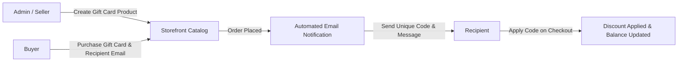

# Introduction

The **Webkul Magento 2 Marketplace Gift Card (`Webkul_MpGiftCard`)** extension expands your Magento 2 multi-vendor store by enabling both the **Store Admin** and **Marketplace Sellers** to create and sell custom digital gift card products. Customers can purchase gift cards for friends or family, input custom messages, and send the gift codes directly via email. 

Recipients can easily apply the unique gift code during checkout. The system automatically tracks remaining gift card balances, allowing recipients to reuse a single gift card across multiple transactions until the full value is exhausted.

---

## Key Highlights

- **Admin & Seller Creation**: Store administrators and marketplace vendors can both launch gift card products from their respective management panels.
- **Customizable Options**: Buyers can specify recipient details (e.g., *Email To*, custom *Message*, recipient name).
- **Special Pricing**: Sellers and admins can define special promotional prices for gift cards.
- **Multi-Purchase Balance Reuse**: Customers do not need to spend the total card value in one order. The system tracks remaining balances and updates records automatically.
- **Configurable Expiry & Active Duration**: Admins can configure the validity window (number of active days) for issued gift cards.
- **Automated Email Notifications**: Recipients receive automated notification emails with the gift card details.
- **Admin Balance Alerts**: Automated alerts notify store administrators when gift card balances are updated or nearing depletion.
- **GraphQL Integration**: Out-of-the-box GraphQL mutation and query support for headless storefronts (PWA Studio, Vue Storefront, custom mobile applications).
- **Hyvä Theme Compatibility**: Out-of-the-box compatibility with [Hyvä Theme](https://www.hyva.io/) for high-performance frontend rendering and modern storefront experiences.

---

## Workflow at a Glance

1. **Setup & Configuration**: Admin enables the extension in `Stores > Configuration > Webkul > Gift Card` and configures email notification templates.
2. **Product Listing**: Admins or Sellers create a Gift Card product, specifying custom options (email, recipient message, price).
3. **Purchasing**: A buyer selects the Gift Card, inputs recipient details, and completes checkout.
4. **Code Delivery**: Once the order status is completed/invoiced, a unique gift coupon code is automatically generated and emailed to the recipient.
5. **Redemption**: The recipient uses the code on any store item during checkout. The discount applies immediately, and any remaining amount is retained for future purchases.
