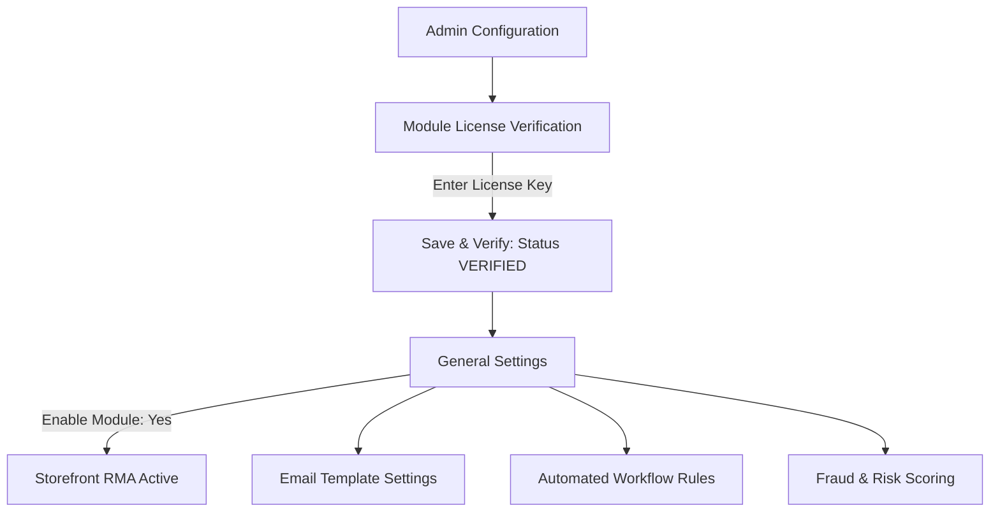

# Configuration

After successfully installing the module, the store administrator must first verify the module license before enabling the RMA system on the storefront. Once verified, the administrator can configure global RMA behavior, transactional email templates, automated workflow rules, and customer fraud scoring.

Navigate to **Stores > Configuration > Webkul** in your Magento Admin Panel.

---

## Module License Verification

Before the module can be enabled or utilized on the storefront, the administrator must verify the extension license. Navigate to **Stores > Configuration > Webkul > Module License**.

Here, the administrator will find the list of all licensed Webkul modules. For the **Marketplace RMA System** module (alongside the prerequisite **Marketplace Multi Vendor** module), the administrator needs to:

1. Locate **Marketplace RMA System** in the **Licensed Modules** table.
2. Enter the valid **License Key** received upon purchasing the extension.
3. Click on the **Save & Verify** button to validate the license key with the licensing server.
4. Once verified, the status indicator will update to a green **VERIFIED** badge.


::: note Mandatory Verification
The extension functionality requires a valid, verified license. The module cannot be enabled on the storefront until the **Marketplace RMA System** license status displays **VERIFIED**. If you update your domain name, migrate hosts, or change your server environment, click the **Re-verify** button to refresh the license certificate.
:::

---

## Enabling & Configuring the Module

Once the module license has been verified, navigate to **Stores > Configuration > Webkul > Marketplace RMA System** (or **Marketplace Management > RMA System > RMA Configuration**) to enable the module and configure general settings, email templates, workflow rules, and fraud mitigation.




---

## General Settings

Configure core storefront availability and foundational policy limits:

- **Enable Module**: Set to **Yes** to activate RMA system functionality across the storefront, or **No** to disable it. *(Note: Module License must be verified first).*
- **Default Allowed Days**: Specify the maximum number of days after order placement or delivery during which customers can file a return, replacement, or cancellation.
- **Admin Email**: The primary email address designated to receive RMA submissions, status changes, and critical escalation alerts.
- **Notify Admin on New RMA**: Set to **Yes** to trigger automated email notices to the admin whenever a buyer creates an RMA.
- **Allow Seller Workflow Configuration**: Set to **Yes** to permit sellers to customize their own automated workflow rules and pending alert thresholds from their vendor panel.
- **Allow Seller Fraud Configuration**: Set to **Yes** to allow sellers to fine-tune fraud mitigation, return thresholds, and risk score criteria for their inventory.

---

## Email Template Settings

Select the Magento transactional email templates dispatched for each milestone in the RMA lifecycle:


- **New RMA Template**: Template sent to the buyer, seller, and administrator upon ticket submission.
- **Update RMA Template**: Template sent when an RMA status changes (e.g., from *Pending* to *Processing* or *Solved*).
- **RMA Message Template**: Template used when a seller, buyer, or admin sends a new message within the interactive chat thread.

---

## Automated Workflow Rules Settings

The built-in rules engine automates repetitive approval decisions and flags stagnant requests:


- **Enable Automated Workflow Rules**: Master switch activating the automated rules and auto-approve subsystem.
- **Enable Pending RMA Alert**: When enabled, the system automatically checks for unattended tickets and alerts management.
- **Hours Threshold**: Specifies how many hours a ticket can remain in *Pending* status before triggering an escalation alert.
- **Manager Email(s)**: Comma-separated email addresses of operations managers or supervisors monitoring unresolved returns.
- **Alert Email Template**: Transactional template used for pending RMA reminder notifications.
- **Send Test Alert Email**: Sends a test notification to verify manager recipient addresses and email delivery.

---

## Auto-Approve Rules

Streamline return processing by automatically approving straightforward requests that fulfill predefined criteria:


- **Enable Auto-Approve Rule**: Automatically transitions qualifying RMA submissions to *Approved* status without manual human intervention.
- **Max Order Age (Days)**: Restricts auto-approval to orders placed within the specified number of days.
- **Allowed Return Reason(s)**: Multiselect list of return reasons (e.g., *Defective item*, *Wrong size*) eligible for automated approval.
- **Allowed Resolution Type(s)**: Restricts auto-approval to chosen resolution types (*Refund* or *Replace*).
- **Allowed Customer Group(s)**: Limits automatic approval to trusted customer groups (e.g., *General*, *Wholesale*, or *VIP*).
- **Minimum Product Price**: Ensures the returned product meets a baseline valuation threshold before auto-approving.
- **Maximum Product Price**: Caps the maximum unit price eligible for auto-approval, protecting merchants from high-value fraudulent claims.
- **Send Approval Email Notification**: Dispatches an instant confirmation email to the buyer once auto-approval occurs.

---

## Fraud & Risk Scoring

Detect serial returners and minimize policy abuse through automated scoring algorithms:


- **Enable Fraud & Risk Scoring**: Analyzes buyer return velocity across the marketplace. High-risk badges display prominently on admin and seller RMA grids.
- **Risk Threshold (Number of Returns)**: Minimum number of return requests within the designated timeframe required to flag a customer as **High Risk**.
- **Risk Timeframe (Days)**: Rolling evaluation window (in days) used to aggregate a customer's return frequency.
- **Exclude RMA Status(es) from Calculation**: Select statuses (such as *Declined* or *Canceled*) that should not contribute toward the customer's risk counter.

---

## Automated Risk Mitigation Actions

- **Require Manual Review for High-Risk Customers**: When enabled, any RMA initiated by a customer categorized as **High Risk** immediately bypasses automated approval rules and mandates manual staff scrutiny.

---

## Admin Alerts & Notifications

- **Send Email Alert on High-Risk RMA Request**: Instantly notifies administrative supervisors when a flagged high-risk user submits a new RMA.
- **Notification Email Address(es)**: Target recipient email addresses for fraud warning alerts (separated by commas).
- **Admin Notification Email Template**: Email template selected for high-risk escalation alerts.
- **Send Test Alert Email**: Sends a verification message to ensure alert deliverability.

::: tip Best Practice
Start with a conservative **Risk Threshold** (e.g., 3 returns within 30 days) and enable **Require Manual Review for High-Risk Customers** to shield your sellers against abusive return patterns.
:::

---

## Saving Configuration

Click **Save Config** in the upper right corner, then clear the Magento cache:

```bash
php bin/magento cache:flush
```
<ExplainCode explanation="Flushes configuration and layout caches to ensure recent admin settings and license state take effect immediately." />
