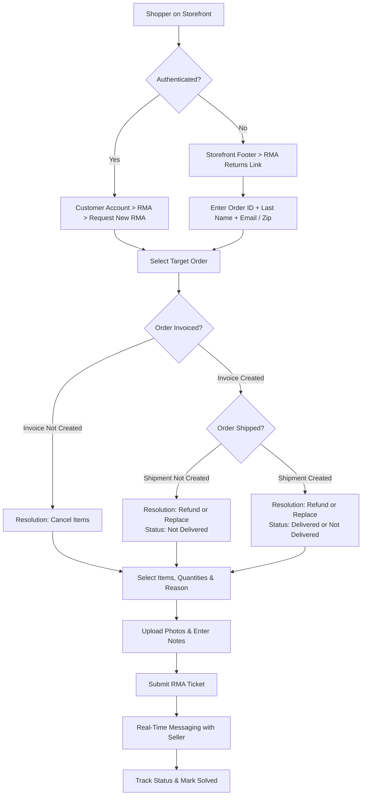

# Customer & Guest Workflow

Customers and guest purchasers can initiate Return Merchandise Authorization requests through intuitive storefront interfaces. The system dynamically presents appropriate resolution options based on order invoice status and delivery milestones.

---

## Registered Customer RMA Submission

1. Log in to your customer account on the storefront.
2. In your customer dashboard menu, navigate to **RMA > Request New RMA**.

Hyva theme customer RMA grid

3. Choose the order you wish to return items for.

::: note Invoice Requirement Rule
- If the order's **Invoice has not been generated**, the system defaults to the **Cancel Items** resolution.
- Once the order's **Invoice has been generated**, customers can choose between **Refund** and **Replace**.
:::

---

## 1. Cancel Items (Uninvoiced Orders)

When a customer needs to cancel items from an order before it has been invoiced or fulfilled:

Hyva theme cancel RMA request

1. **Order Selection**: Select the relevant order from the dropdown list.
2. **Resolution**: The system automatically selects **Cancel Items**.
3. **Item Selection**: Check the individual items you wish to cancel.
4. **Quantity**: Enter the cancellation quantity.
5. **RMA Reason**: Select the reason for canceling from the dropdown list.
6. **Images**: Upload any relevant reference photos or screenshots.
7. **Additional Information**: Provide supplementary context for the seller.
8. **Order Status**: Set to **Not Delivered** by default because no shipment has been created.
9. Click **Submit**.

---

## 2. Replace Item (Invoiced Orders)

When an invoiced item arrives defective, damaged, or in the wrong size, customers can request a direct replacement:

Hyva theme replace RMA request

1. Select the invoiced order.
2. Under **Resolution**, select **Replace**.
3. Choose the product and specify the replacement quantity.
4. Choose the RMA Reason (e.g., *Defective item*, *Wrong size*).
5. Upload clear images of the item showing any defect or damage.
6. **Order Status**:
   - **Not Delivered**: If the order was invoiced but the parcel has not yet arrived.
   - **Delivered**: If the parcel was delivered and the defect was discovered upon unboxing.
7. Click **Submit**.

Hyva theme View RMA

Once the seller reviews the request and ships the replacement item, the customer can check the checkbox **Close RMA** and click on **Marked as Solved** to close the RMA.

---

## 3. Refund Item (Invoiced Orders)

If a customer prefers a monetary refund for an invoiced purchase:

Hyva theme refund RMA request

1. Choose the target order and select **Refund** from the Resolution dropdown.
2. Select the items and quantities to be refunded.
3. Choose the appropriate return reason and attach photos.
4. Set the Order Status (**Delivered** or **Not Delivered**).
5. Click **Submit**.
6. Track the status updates as the seller reviews the claim and issues the refund via the original payment method, offline transaction, or store wallet.

---

## Interactive Messaging & RMA Timeline

Buyers and sellers can communicate directly within the RMA detail page:

Hyva theme RMA messages

- Exchange questions, photos, and shipping receipts.
- Track resolution status changes in real time.

---

## Guest Users RMA Portal

Guest shoppers who placed orders without creating an account can initiate and manage RMAs through the guest portal:

1. Click the **RMA Returns** link situated in the storefront footer.
2. Enter the verification credentials:
   - **Order ID**: The unique order number from your confirmation email.
   - **Billing Last Name**: The last name specified in the billing address.
   - **Find Order By**: Choose **Email Address** or **ZIP Code** and provide the corresponding value.

Hyva theme Guest Login

3. Click **Login** to access the guest RMA generator and manage tickets.

Hyva theme Guest RMA Panel

