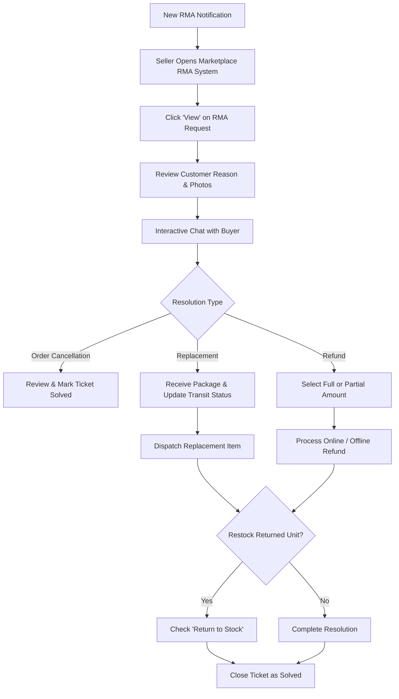

# Seller Workflow

Marketplace vendors can independently manage return and replacement requests filed for their catalog items directly from their dedicated seller dashboard. Sellers can communicate with buyers, update transit statuses, ship replacements, or issue full and partial refunds with automated inventory restock.

---

## Accessing Seller RMA Panel

To view and manage customer returns:

1. Log in to the seller account on the storefront.
2. In the vendor navigation menu, click **Marketplace RMA System**.

Hyva theme Seller RMA Panel

3. The grid displays all return requests submitted for the seller's products, detailing the Order ID, Customer Name, Resolution Type, Status, and Date.
4. Click the **View** link under the Action column to open the detailed ticket view.

Hyva theme View RMA

From the details view, the seller can:
- Inspect returned item SKU, title, and quantity requested.
- Review customer explanations and uploaded photos.
- Chat with the buyer through the integrated messaging panel.
- Update tracking and resolution statuses.

---

## Processing Order Cancellations

When a buyer requests an RMA for an **uninvoiced** order to cancel items:

Hyva theme View RMA

1. Review the cancellation reason submitted by the customer.
2. Communicate any relevant details through the messaging box if clarification is needed.
3. Update the RMA status to **Solved** to confirm the cancellation.

---

## Processing Item Replacements

When a customer requests a replacement for a defective, damaged, or incorrectly sized product:

Hyva theme Seller Replacement RMA

1. Under **Update RMA Status**, select the current physical package milestone:
   - **Pending**: Awaiting package receipt or review.
   - **Not Receive Package Yet**: Customer has not yet dispatched or delivered the parcel.
   - **Received Package**: Returned parcel has safely arrived at the seller's facility.
   - **Dispatched Package**: Seller has shipped the replacement parcel to the buyer.
   - **Declined**: Return rejected due to policy breach or expired inspection.
2. **Return to Stock**: Check this box if the returned item is undamaged and should be added back into catalog inventory.
3. Click **Save Status**.
4. Once the replacement item is dispatched to the buyer, update the status to **Dispatched Package** and provide tracking information in the chat.

---

## Processing Item Refunds

When an invoiced order requires a monetary refund:

Hyva theme Seller Refund RMA

1. In the **Update RMA Status** section, verify package receipt and update the status accordingly.
2. Navigate to the **Process Refund** section and select the **Payment Type**:
   - **Full Amount**: Issues a complete refund of the eligible order total.
   - **Partial Amount**: Allows the seller to specify a custom partial refund amount.
3. **Return to Stock**: Check this option to automatically increment product inventory upon refund completion.
4. Click **Refund Offline** (or **Refund Online**, depending on whether the payment gateway supports automatic API refund disbursement).
5. The buyer receives an automated email notification confirming their refund has been successfully executed.
