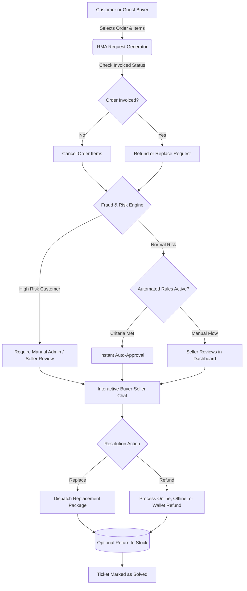

# Introduction

The **Webkul Magento 2 Marketplace RMA System** extension transforms return, replacement, and refund management across multi-vendor Adobe Commerce and Magento 2 stores. Customers and guest buyers can initiate Return Merchandise Authorization (RMA) requests directly against specific sellers and orders, while sellers and marketplace administrators gain full control over automated approval rules, customer fraud risk mitigation, real-time messaging, and restock fulfillment.



---

## Key Highlights

- **Multi-Vendor Return Routing**: Customers file RMA requests against specific orders and individual marketplace sellers, keeping seller operations and return pipelines completely partitioned.
- **Dynamic Resolution Options**: Intelligent resolution logic dynamically offers **Cancel Item** for uninvoiced orders and **Refund** or **Replace** once orders are invoiced.
- **Automated Workflow Rules Engine**: Configure global and seller-level auto-approval rules based on order age, return reasons, resolution types, customer groups, and item price bounds.
- **Pending RMA Alert System**: Automated alerts notify managers and sellers when an RMA ticket remains unhandled beyond a configurable hour threshold.
- **Fraud Detection & Risk Scoring**: Automatically computes customer return frequency over rolling time windows, marks serial returners as High Risk, and forces manual staff review.
- **Interactive Two-Way Messaging**: Built-in chat channel enables direct, documented communication between buyers, sellers, and store administrators with file/image attachments.
- **Full & Partial Refunds**: Sellers can process full or partial refunds through online payment gateways, offline transactions, or customer wallet accounts.
- **Return to Stock Automation**: Optional one-click inventory restock automatically restores item quantities back into the merchant's catalog upon RMA closure.
- **Guest RMA Return Portal**: Dedicated guest interface accessible via storefront footer links allowing guest purchasers to authenticate with Order ID and Email/Billing Zip Code.
- **EU Withdrawal Compliance**: Built-in compliance with Directive (EU) 2023/2673, giving shoppers a transparent electronic cancellation mechanism within statutory 14-day return periods.
- **Hyvä Theme & GraphQL Ready**: Native GraphQL coverage and complete compatibility with [Hyvä Theme](https://webkul.com/hyva-theme-development/) via companion module.

---

## Workflow at a Glance

1. **System Setup & Dependencies**: Ensure Webkul Multi-Vendor Marketplace is installed, configure global return policies, and register custom RMA reasons in the Magento Admin Panel.
2. **Automated Rules & Fraud Configuration**: Define hours thresholds for stale RMA alerts and establish auto-approval limits and risk frequency thresholds.
3. **Buyer Submission**: A logged-in customer or guest shopper opens the RMA generator, chooses order items, selects a reason, uploads images, and submits the request.
4. **Seller Review & Communication**: The seller receives an automated email notification, reviews the ticket on their vendor panel, chats with the buyer, and selects the resolution.
5. **Resolution & Inventory Restoration**: The seller dispatches replacement tracking details or issues a refund. If configured, items are automatically returned to inventory stock.

```bash
php bin/magento setup:upgrade
```
<ExplainCode explanation="Registers Webkul_MpRmaSystem, creates necessary database tables for RMA requests, reasons, messages, and rules." />

---

::: tip EU Right of Withdrawal Directive
The Marketplace RMA System supports EU Directive (EU) 2023/2673 by presenting a clear electronic cancellation button, empowering consumers to exercise their statutory 14-day right of withdrawal for eligible purchases with complete auditability.
:::
