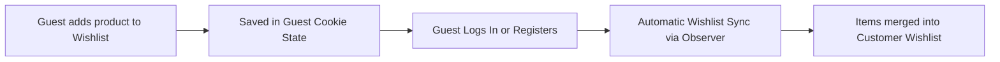

# Sharing & Guest Synchronization

The module enables customers to share their curated wishlists with others and allows guest visitors to save products before creating an account.

---

## Wishlist Sharing via Email & Link

Customers can share any of their custom wishlists via email:

1. Open the desired wishlist in **My Account > My Wish List**.
2. Click **Share Wishlist**.
3. Enter one or more recipient email addresses separated by commas, along with an optional custom message.
4. Click **Share Wishlist**.

### How Recipients View Shared Wishlists

* Each shared wishlist generates a unique `sharing_code`.
* Recipients receive an email containing a link to view the shared wishlist on the storefront.
* Visitors can view the shared products and add items directly to their own cart or wishlist.

---

## Guest User Wishlist Synchronization

Non-logged-in guest shoppers can also build wishlists while browsing the store:

### Guest Synchronization Workflow

1. When a guest shopper clicks **Add to Wish List**, items and options are stored temporarily in guest session cookies.
2. When the guest logs in or registers a new account, the module's `CustomerLogin` and `AssignMultiWishlistId` observers trigger.
3. The guest items stored in cookies are automatically converted into customer wishlist entities and saved to `wk_wishlist_name` and `wishlist_item` tables.
4. The guest cookie state is cleared cleanly after synchronization.
