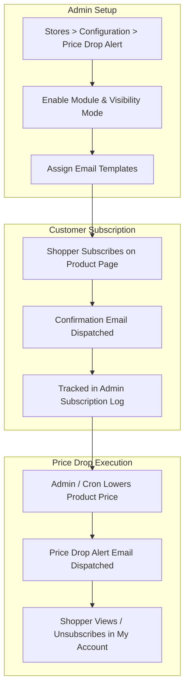

# Configuration Overview

The **Magento 2 Price Drop Alert** workflow consists of three main components:

---

### Navigation Map

- **Admin Module Setup**: `Stores > Configuration > Webkul > Price Drop Alert`
- **Admin Subscription Log**: `Price Drop Alert > Price Drop Alert Log`
- **Custom Email Templates**: `Marketing > Email Templates`
- **Customer Account Portal**: `My Account > Subscribed Product List`
