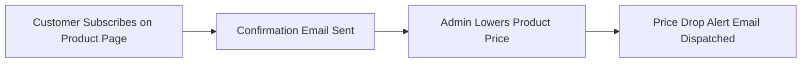

# Introduction

**Magento 2 Price Drop Alert** extension allows customers to receive instant automated email alerts whenever a product price drops.

Both guest visitors and registered store customers can subscribe or unsubscribe to price drop notifications for any product. Users simply enter their email address in the price drop subscription widget on the product page.

::: tip Supported Product Types
The module supports **Simple**, **Virtual**, **Downloadable**, and **Configurable** products.
:::

### Key Features

- **Enable / Disable Control**: Easily toggle price drop subscription functionality across the store.
- **Global or Product-Specific Visibility**: Apply price drop subscription on all store products or manually select specific products.
- **Guest & Registered User Support**: Allow guest visitors and logged-in customers to subscribe to unlimited products.
- **Automated Transactional Emails**: Configurable email templates for subscription confirmation, price drop alerts, and unsubscription notifications.
- **Customer Account Portal**: Registered users can view, manage, and bulk-unsubscribe from their **Subscribed Product List**.
- **Admin Subscription Log**: Unified backend log to track subscriber emails, products, subscription dates, and status.
- **Hyvä Theme & GraphQL**: Out-of-the-box compatibility with the Hyvä Theme and GraphQL APIs.

---

### Workflow Overview

