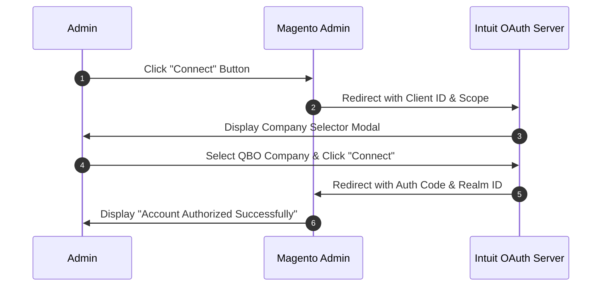

# Activation & OAuth2 Authorization

After installing the extension, you must activate the module license and complete the Intuit OAuth 2.0 authentication setup to enable order and financial data synchronization between Magento 2 and QuickBooks Online.

---

## 1. Module License Registration

The **Magento QuickBooks Connect** extension requires license verification via **Webkul Base**:

1. Log in to your **Magento Admin Panel**.
2. Navigate to **Webkul > Module License** (or **Stores > Configuration > Webkul > Module License**).
3. Locate **Magento QuickBooks Connect** in the registered module list.
4. Enter your purchase order details and license key provided in your Webkul store account.
5. Click **Save Config**.


---

## 2. Configure OAuth2 Credentials in Admin

1. Navigate to **Stores > Configuration > Webkul > Magento Quickbooks Connect**.
2. Under **General Settings**:
   * Set **Enable** to `Yes`.
   * Set **App Integration With** to `OAuth 2.0`.
   * Set **Account Type** to `Development` (for Sandbox testing) or `Production` (for live store).
   * Enter your **Client Id** and **Client Secret** obtained from the Intuit Developer Portal.
3. Click **Save Config**.


---

## 3. Execute OAuth2 Connection Flow

After saving your API credentials, follow these steps to connect Magento to your QuickBooks Online account:



1. Click the **Connect** button located under **Stores > Configuration > Webkul > Magento Quickbooks Connect**.

2. An Intuit authorization pop-up window will open. Select your QuickBooks Online **Company** from the drop-down menu and click **Next**.


3. Review the requested scope permissions (Access Accounting & Payments data) and click **Connect**.


4. Upon authorization, Intuit redirects back to your store's OAuth callback endpoint (`/quickbooksconnect/oauth/oauth2`). A success pop-up notification confirms authorization:


5. Refresh your browser page. The configuration page will now display **Connected** status along with a **Disconnect** button.


---

## 4. Automatic Token Refresh Mechanism

Intuit OAuth 2.0 access tokens expire after 60 minutes, while refresh tokens remain valid for up to 100 days.

The **Webkul QuickBooks Connect** module includes a built-in automated cron task (`qb_access_token_update`) that runs every 30 minutes:

```bash:no-line-numbers
# Cron schedule: */30 * * * *
# Method: Webkul\QuickbooksConnect\Model\Cron::accessTokenValidate()
```
<ExplainCode explanation="Automatically inspects access token expiration timestamps and fetches fresh access tokens using the stored refresh token without requiring admin re-authorization." />

::: tip Token Management Note
Do not share or expose Client Secret or Refresh Token keys. If you ever click **Disconnect**, the OAuth tokens will be invalidated and you must perform the **Connect** flow again.
:::
