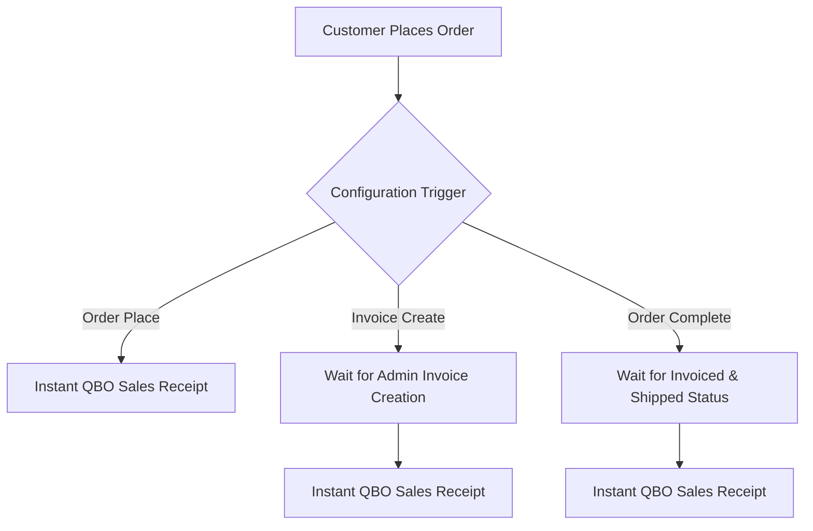

# Sales Receipts Management

The **Magento 2 QuickBooks Connect** extension syncs Magento store orders into QuickBooks Online as official **Sales Receipts**.

---

## Automatic Sales Receipt Creation

When automatic synchronization is enabled, order export triggers depend on your **Sales Receipt Create On** setting in module configuration:

* **Order Place**: Every order placed by guest or registered shoppers is exported to QuickBooks immediately.
* **Invoice Create**: Orders are exported to QuickBooks as soon as an admin or automated payment workflow generates a Magento invoice.
* **Order Complete**: Orders are exported to QuickBooks only when full shipment and invoice processing transitions order status to `Complete`.

---

## Manual Sales Receipt Synchronization

You can also manually batch-export historical or un-synced store orders to QuickBooks Online using two administrative methods:

### Method A — Export from Magento Orders Grid

1. Go to **Sales > Orders** in Magento Admin.

2. Select the checkbox for orders you want to export.
3. In the **Actions** dropdown menu at the top of the grid, select **Export on QB**.

4. A progress dialog window will execute the batch synchronization and show execution logs upon completion.

### Method B — Export from Map Sales Receipt Grid

1. Go to **Connect > Map Sales Receipt** (or **Webkul QuickBooks Connect > Map Sales Receipt**).

2. Click the **Export Orders as Sales Receipt** button in the top right.

3. Magento will query all orders matching your configured status filter (`Pending`, `Processing`, or `Complete`) and export them to QuickBooks Online.

---

## Map Sales Receipt Admin Grid

Navigate to **Connect > Map Sales Receipt** to inspect all mapped sales receipt records:

| Column Name | Description |
| :--- | :--- |
| **Map ID** | Internal primary key for the mapping relationship record. |
| **Order ID** | Increment ID of the Magento sales order (e.g., `#000000012`). |
| **QuickBooks Receipt ID** | Unique sales receipt ID generated by QuickBooks API. |
| **Customer Name / Email** | Billing customer name and email address exported. |
| **Created At** | Date and timestamp when mapping was recorded. |
| **Actions** | Click **View Order** to inspect detail breakdown or **Delete** to purge mapping record. |

Clicking **View Order** displays full Magento order invoice details:

---

## Inspecting Synced Data in QuickBooks

To view exported sales receipts inside your QuickBooks Online account:

1. Log in to **QuickBooks Online**.
2. Go to **All Apps > Sales & Get Paid > Sales Transactions**.

3. Click on the exported **Sales Receipt** matching the Magento Order Number:

4. To inspect the account mapping on exported products, go to **All Apps > Sales & Get Paid > Products and Services**:

5. Click **Edit** on any item to view its linked Inventory Asset, Income, and Expense accounts:

