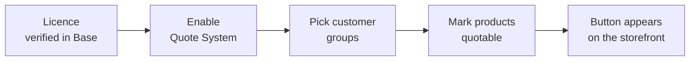

# Activate & Connect

The extension is installed but does nothing until it is licensed and enabled.

## 1. Verify the licence

The Quote System is gated by **Webkul Base**. Until Base has verified your licence key, the
extension's master switch cannot be turned on.

1. Go to **Stores → Configuration → Webkul → Base**.
2. Enter the licence key supplied with your purchase.
3. Save the configuration.

::: warning
If you set **Enable Quote System** to *Yes* and it reverts to *No* after saving, the licence has
not been verified. Complete this step first — nothing else will hold.
:::

## 2. Enable the extension

1. Go to **Stores → Configuration → Webkul → Quote System → General**.
2. Set **Enable Quote System** to *Yes*.
3. Save the configuration and flush the cache.

## 3. Choose who can request quotes

Still under **General**:

- **Customer Groups** — which groups see the Add to Quote button. Select the groups that should
  be able to negotiate; leave the rest out and they see a normal storefront.
- **Allow Guest Quotes** — whether visitors without an account can request a quote.

## 4. Make a product quotable

The button only appears on products you have marked as quotable. This is deliberate: you decide
what is negotiable.

1. Edit any product.
2. In **Product Details**, set **Enable Request a Quote** to *Yes*.
3. Save.

See [Enable a Product](/using/enable-a-product) for doing this in bulk.

## 5. Check the storefront

Open that product on the storefront as a customer in an allowed group. You should see **Add to
Quote** beside Add to Cart, and a quote-cart icon in the header.

If the button does not appear, work through [Troubleshooting](/help/troubleshooting).
