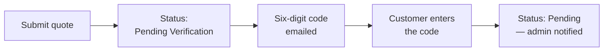

# General

**Stores → Configuration → Webkul → Quote System → General**

| Setting | Description |
|---|---|
| **Enable Quote System** | The master switch. Set to *No* and the extension is inert: no button, no quote cart, no routes. |
| **Customer Groups** | Which customer groups can request a quote. A shopper outside these groups sees a normal product page with no Add to Quote button. |
| **Allow Guest Quotes** | Whether visitors without an account can request a quote. |
| **Merge Guest Quote on Login** | When a guest who had built a quote cart signs in, move that cart into their account. |
| **Verify Guest Email** | Hold a guest's submission until they enter a code emailed to them. |
| **Verify Customer Email** | The same check for signed-in customers. |

## Enable Quote System

This is gated by your licence — see [Activate & Connect](/activation). If it will not stay on,
the licence has not been verified in Webkul Base.

## Customer Groups

Use this to make quoting a privilege. A common B2B setup is to allow quotes only for a
*Wholesale* group, so retail shoppers buy at the listed price and wholesale customers negotiate.

The check runs on every product page, listing card and quote-cart action, so a customer outside
the selected groups cannot reach the flow even with a direct URL.

## Allow Guest Quotes

With this on, a visitor can build a quote cart and submit it by giving an email address, first
name and last name. They get a link to follow the conversation without creating an account.

::: tip
A guest cannot submit a quote using an email address that already belongs to a registered
account. They are asked to sign in instead. This stops a quote being orphaned outside the
account it belongs to.
:::

## Merge Guest Quote on Login

A visitor who builds a quote cart, then signs in, keeps what they collected. Each line is
replayed into the customer's own quote cart with its options, quantity and requested price
intact.

Turn it off and the guest cart is left behind at login.

## Email verification

Verification protects you from junk requests sent under someone else's address.

When it is on, submitting does not create the request straight away. The quote is held with the
status **Pending Verification**, a six-digit code is emailed, and the shopper enters it on a
verification page. Only then does it become a real request.

You can require this of guests, of signed-in customers, or both.

::: warning
If the code email cannot be sent, the quote is not held and the shopper is not locked out —
the submission goes through as normal. Verification never traps a request behind a mail server
that is down.
:::
