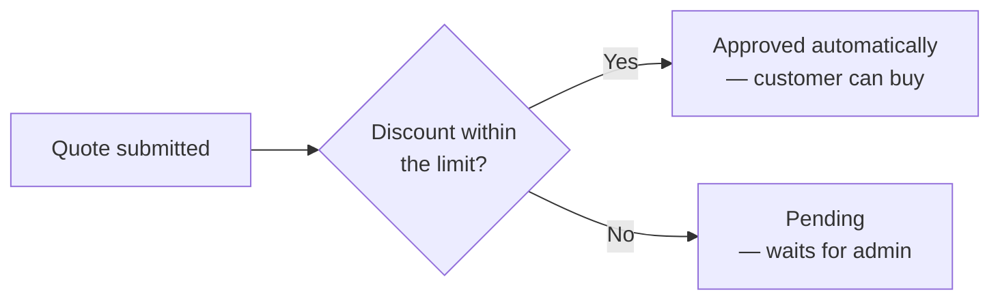

# Workflow

**Stores → Configuration → Webkul → Quote System → Workflow**

| Setting | Description |
|---|---|
| **Auto Approve** | Approve requests automatically when the discount asked for is small enough. |
| **Auto Approve Max Discount (%)** | The largest discount that will be approved automatically. |
| **Quote Expiry (days)** | How long an approved quote stays valid. |
| **Reminder (days)** | How many days before expiry to email the customer. |

## Automatic approval

Most quote requests are routine — a customer asking for 5% off a bulk order. Auto approval
clears those without you touching them, and leaves the real negotiations for your team.

With **Auto Approve** on, a submitted quote is checked against **Auto Approve Max Discount**. If
every line asks for a discount within that limit, the quote is approved on the spot: each line's
offered price and quantity are set to what the customer requested, and they can buy immediately.

Anything asking for more lands as **Pending** and waits for you.

::: tip
Start with a conservative limit — 5% is a common starting point — and raise it once you can see
from the grid how much of your volume it clears.
:::

## Quote expiry

**Quote Expiry (days)** sets how long a quote stays valid after it is submitted. A daily cron job
moves quotes past that date to the **Expired** status, and an expired quote cannot be purchased.

Set it to **0** to switch expiry off; quotes then stay valid indefinitely.

## Expiry reminders

**Reminder (days)** emails the customer that many days before their quote expires — a useful
nudge on a quote they have not acted on. A second daily cron job sends these, and each quote is
reminded only once.

Set it to **0** to switch reminders off.

::: warning
Both features run on cron. If cron is not configured, quotes never expire and reminders are never
sent. Check with `php bin/magento cron:run` and confirm the `wk_raq_expire_quotes` and
`wk_raq_remind_expiring_quotes` jobs are running.
:::
