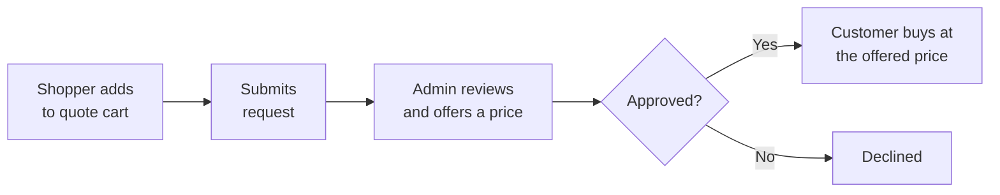

# Introduction

The **Magento 2 Quote System** extension adds a request-for-quote (RFQ) flow to your store.
Instead of buying at the listed price, a shopper asks for a price — and you answer.

## What it does

A shopper browsing your catalogue sees an **Add to Quote** button next to Add to Cart. They
choose a quantity, suggest the price they want to pay, and add a note. Products collect in a
**quote cart** that is separate from the shopping cart, so a request can cover several items at
once. When they submit it, the request lands in your admin panel.

From there you review each line, set the price and quantity you are prepared to offer, and
approve or decline the quote. The customer sees your offer in their account, and can buy the
approved quote at the negotiated price in one click.

## Who it is for

- **B2B and wholesale stores**, where price depends on volume and the customer expects to negotiate.
- **Made-to-order and configurable products**, where the final price depends on what the customer needs.
- **High-value catalogues**, where a conversation closes the sale better than a fixed price.

## What is included

| Area | What you get |
|---|---|
| Storefront | Add to Quote on product pages and category/search listings, a dedicated quote cart, a header quote-cart with a live count, and a My Quotes section in the customer account |
| Guests | Quote requests without an account, optional email verification by code, and automatic merging into the account on login |
| Product types | Simple, virtual, downloadable, configurable, bundle and grouped — with the exact selections replayed onto the order |
| Admin | A quote grid, a detail page to edit offered price and quantity per line, status control, and an inline conversation |
| Workflow | Automatic approval within a discount limit, quote expiry, and expiry reminders on cron |
| Communication | Six transactional emails and a two-way conversation with unread tracking |
| Attachments | Customers can attach files to a request, within limits you set |
| Custom fields | Ask your own questions on the quote form with a dynamic form builder |
| Headless | The full storefront flow over GraphQL |

::: tip
The quote cart is a clone of Magento's own cart, not a bolt-on. Options, custom options,
bundle selections and configurable variants behave exactly as they do in the shopping cart, and
they survive the conversion to an order.
:::
