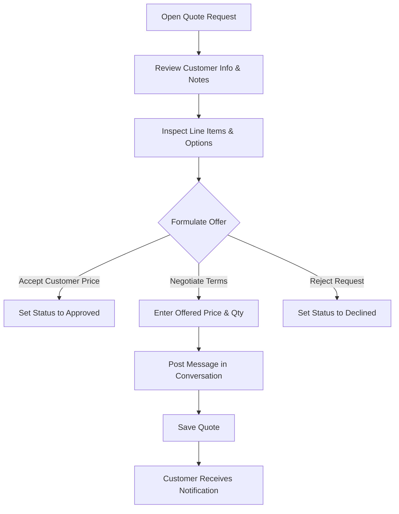

# Reviewing & Counter-Offering

When a shopper submits a quote request, store administrators review the requested lines, formulate counter-offers, and negotiate terms directly from the Magento Admin Panel.

---

## Accessing the Quote Detail Page

1. Navigate to **Webkul Quote System → Manage Quote Requests**.
2. Click anywhere on the row or click **View** under the Action column to open the quote.

---

## Step-by-Step Review Workflow

The quote view is structured into four primary operational sections:

### 1. Header Information & Status
- **Quote Identification**: Quote number (e.g., `#000000034`), creation timestamp, and assigned store view.
- **Customer Details**: Name, email address, customer group, and telephone.
- **Quote Status**: Dropdown to transition the quote between states:
  - `Pending`: New submission awaiting initial review.
  - `Processing`: Under review (notifies customer that calculations are in progress).
  - `Approved`: Offer is finalized and customer is permitted to purchase.
  - `Declined`: Proposal cannot be fulfilled.
  - `Expired`: Automatically triggered if the validity window lapses.
  - `Ordered`: Read-only state once converted to a completed Magento order.

### 2. Line Items Table & Offer Fields
The table compares catalogue values with customer requests and admin counter-offers:

| Column | Description | Admin Editable |
|---|---|:---:|
| **Product Information** | Name, SKU, variant attributes, and dynamic form inputs | No |
| **Original Price** | Base catalogue price before quote discounts | No |
| **Requested Price** | The price per unit proposed by the shopper | No |
| **Requested Qty** | Number of units requested | No |
| **Offered Price** | Your counter-offered price per unit | **Yes** |
| **Offered Qty** | The quantity you agree to supply at this price | **Yes** |
| **Line Status** | Status per line item (Requested, Approved, Declined) | **Yes** |
| **Subtotal** | Calculated based on Offered Price × Offered Qty | Calculated |

::: tip Quick Approval Shortcut
To accept the customer's requested price without changes, simply change the **Quote Status** dropdown to **Approved** and click **Save**. The system will automatically populate the Offered Price with the customer's Requested Price.
:::

---

## Communicating with the Buyer

Negotiations often require clarifying specifications, delivery schedules, or volume tiers.

1. Scroll to the **Conversation & History** section at the bottom of the page.
2. Enter your message in the text area.
3. Click **Submit Comment**.
4. The message is instantly recorded with an admin badge, and an email alert is dispatched to the buyer through Magento's asynchronous message queue.

---

## Saving and Notifying

Click **Save Quote** in the top action bar to commit your changes:
- If changed to **Approved**, the buyer receives an approval email with a direct link to purchase the quote.
- If changed to **Declined**, the buyer receives a notification explaining the status.
- The **Unread** flag is cleared on your admin grid, and an unread marker is set on the customer's **My Account → My Quotes** dashboard.

---

## What Happens Next?

Once the customer accepts your offer, they click **Proceed to Purchase** on the storefront:
- The items are transferred to their shopping cart at the **Offered Price**.
- Standard Magento checkout handles shipping and payment.
- When the order is placed, the quote automatically flips to **Ordered** status with a clickable link to the new Magento Order ID.
