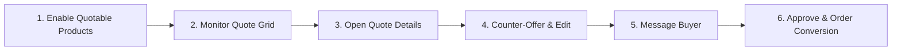

# Managing Quotes in Admin

Store administrators manage incoming quote requests, negotiate prices, converse with buyers, and track conversions from the Magento Admin Panel.

Navigate to **Webkul Quote System → Manage Quote Requests**.

---

## The Merchant Management Workflow

1. **Enable Quotable Products**: Turn on quoting for individual products or bulk-update entire categories via Catalog Products.
2. **Monitor Quote Grid**: Review new incoming requests, filter by pending status, unread customer messages, or approaching expiry dates.
3. **Open Quote Details**: Examine customer notes, requested unit prices, quantities, attachments, and dynamic form inputs.
4. **Counter-Offer & Edit**: Formulate competitive counter-offers with offered prices and quantities, or accept the buyer's terms.
5. **Message Buyer**: Clarify project specs or delivery windows using the built-in two-way conversation thread.
6. **Approve & Order Conversion**: Approve the quote; when the customer completes checkout, the quote converts to **Ordered** status with a linked Magento Order ID.

---

## The Quote Requests Grid

The grid displays every quote submitted across your store views, sorted by newest first:

| Column | Description |
|---|---|
| **Quote #** | The unique quote identifier (e.g., `#000000034`) |
| **Customer Name** | Registered buyer name or guest contact |
| **Customer Email** | Contact email address |
| **Quote Total** | Current calculated total based on customer requested or admin offered prices |
| **Status** | Current lifecycle state: `Pending`, `Processing`, `Approved`, `Declined`, `Ordered`, `Expired` |
| **Order #** | Linked Magento Order ID once converted to an order |
| **Order Status** | Status of the converted Magento order (Pending, Processing, Complete) |
| **Submitted At** | Date and time the request was received |
| **Unread Messages** | Notification count indicating pending customer replies |
| **Expiry Date** | The date after which an approved offer lapses |
| **Action** | Direct link to view and edit the quote |

### Efficient Queue Filtering

Use the grid filters to prioritize daily operations:
- **Pending Quotes**: Filter `Status = Pending` and sort `Submitted At` ascending to respond to older requests first.
- **Unread Conversations**: Filter by quotes with active unread messages to reply to buyers promptly.
- **Expiring Quotes**: Filter `Status = Approved` with `Expiry Date` within 48 hours to send follow-up reminders before deals lapse.

---

## Inspecting and Formulating Offers

Clicking **View** on any row opens the detailed quote management screen:

On this page, admins can:
- Compare catalogue base prices against requested prices.
- Enter custom **Offered Price** and **Offered Quantity** per item line.
- Update line statuses (`Requested`, `Approved`, `Declined`).
- Post replies in the **Conversation** thread with automated email dispatch.
- Transition quote status to **Approved**, allowing the customer to purchase immediately.

For a detailed step-by-step walkthrough of counter-offering, see [Reviewing & Counter-Offering](/using/admin-counter-offer).

---

## Status Reference

| Status | Meaning & Impact |
|---|---|
| **Pending** | Default status for new submissions awaiting admin review. |
| **Processing** | Admin has opened the quote and is calculating custom pricing or freight. |
| **Approved** | Admin has finalized the offer; customer can now click **Proceed to Purchase**. |
| **Declined** | Proposal cannot be fulfilled; locked against further checkout. |
| **Ordered** | Automatically assigned when the customer successfully checks out through Magento. |
| **Expired** | Automatically set by Magento cron when the quote validity date passes without purchase. |

::: tip Reactivating Expired Quotes
An expired quote can be reactivated at any time. Simply open the quote in admin, extend the expiry date, change status back to **Approved**, and save. The customer can immediately complete the purchase.
:::
