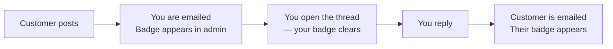

# Conversation

A message thread attached to a quote, so you and the customer can settle the details without
leaving the store. Turn it on under [Conversation](/configuration/conversation).

## For the customer

From **My Account → My Quotes**, open a quote and click **Conversation**. A panel slides in with
the thread — oldest at the top, newest at the bottom — and a box to type a reply.

A divider marks where the messages they have not read begin, so they can pick up where they left
off. Scrolling to the top loads older messages.

Guests reach the same thread through the private link emailed to them.

## For you

The thread is on the quote detail page in admin. Post a reply, and the customer is emailed.

## Unread badges

Each side has its own read marker:

- The customer sees a badge on the **Conversation** button and an **Unread** column in My Quotes.
- You see an unread count in the admin grid.

Opening the thread clears that side's badge, and leaves the other alone.



## Email notifications

Every message triggers an email to the other side, using the **Quote Message** template.

These are sent through Magento's message queue rather than while the page loads, so posting a
message is never held up by the mail server. The consumer must be running:

```bash
php bin/magento queue:consumers:start webkul.quotesystem.conversation.notify
```

::: warning
If messages appear in the thread but no emails arrive, the consumer is not running. This is the
most common cause — check it before looking at your mail configuration.
:::
