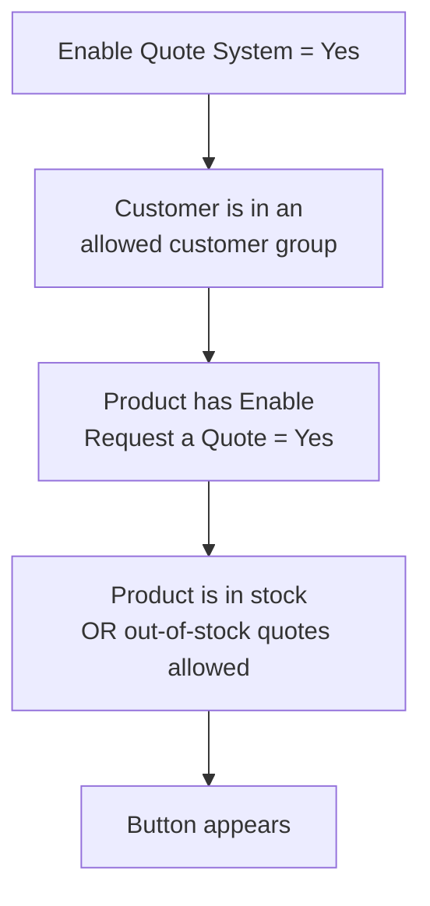

# Enable a Product

The Add to Quote button appears only on products you have marked as quotable. Nothing in your
catalogue becomes negotiable by accident.

## One product

1. Go to **Catalog → Products** and open the product.
2. In the **Product Details** section, find **Enable Request a Quote** — it sits just under
   *Enable Product*.
3. Set it to **Yes**.
4. Save.

## Many products at once

The attribute is available in the product grid, so you can set it in bulk:

1. Go to **Catalog → Products**.
2. Use **Filters** to narrow the list — by attribute set, category, price, or anything else.
3. Tick the products, or use **Select All**.
4. From **Actions**, choose **Update attributes**.
5. Set **Enable Request a Quote** to *Yes* and submit.

You can also filter the grid *by* the attribute, which is the quickest way to audit which
products are currently quotable.

## Scope

The attribute is store-view scoped. A product can be quotable on one store view and not another —
useful when one site is B2B and another retail.

## What else has to be true

Marking a product is one of several conditions. The button appears when **all** of these hold:

If a product you have marked shows no button, work through
[Troubleshooting](/help/troubleshooting).
