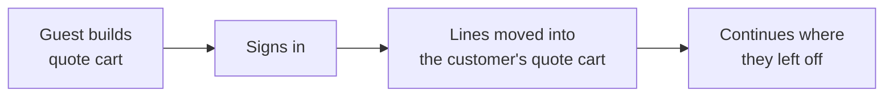

# Guest Quotes

Visitors can request a quote without creating an account, if you have
[allowed it](/configuration/general).

## How it works for the visitor

1. They add products to the quote cart exactly as a signed-in customer would.
2. On the quote cart they give an **email address**, **first name** and **last name**.
3. They submit.
4. If [guest verification](/configuration/general) is on, they enter a six-digit code emailed to
   them.
5. They receive their quote request number, and a link to follow the conversation.

## Following up without an account

A guest has no My Quotes page, so the emails they receive carry a private tokened link to their
quote. It opens a page showing the quote number, its status and total, and the conversation — so
they can keep talking to you without signing up.

The link is unguessable and specific to that one quote.

## Email addresses that already have an account

A guest cannot submit under an email address that belongs to a registered customer. They are
asked to sign in instead.

This is deliberate: without it, a quote would be stranded outside the account it belongs to, and
the customer would never see it in My Quotes.

## Merging on login

If **Merge Guest Quote on Login** is on, a visitor who builds a quote cart and then signs in
keeps everything they collected. Each line is replayed into their own quote cart, with options,
quantity, requested price and notes intact.

Turn the setting off and the guest cart is left behind at login.

::: tip
Merging is the single biggest thing you can do to stop guests abandoning a quote. A shopper who
builds a request, is asked to sign in, and finds their work gone rarely starts again.
:::
