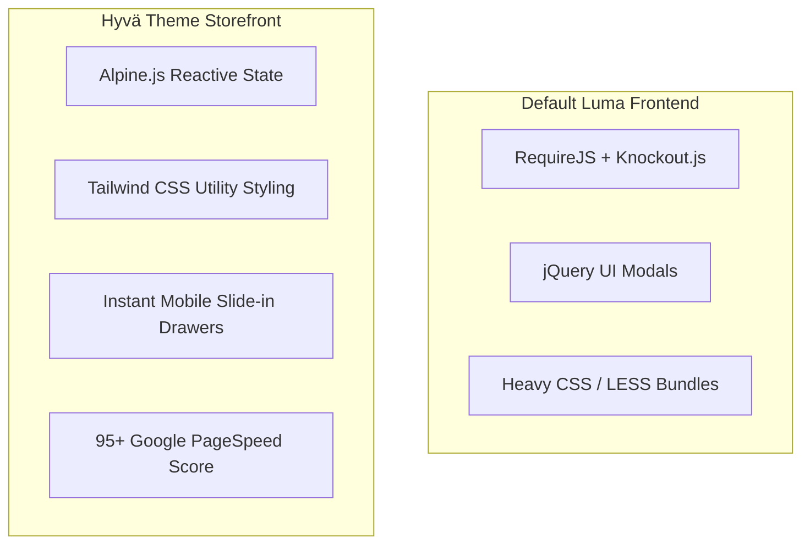

# Hyvä Theme Storefront

The Webkul Quote System provides first-class compatibility with **Hyvä Themes** through the `Webkul_QuotesystemHyva` module.

Hyvä replaces Magento's standard Luma frontend stack (RequireJS, Knockout.js, jQuery, and LESS) with **Alpine.js** and **Tailwind CSS**, delivering sub-second page loads and near-perfect Google PageSpeed scores.



---

## Storefront Features on Hyvä

Every stage of the quote workflow is rebuilt natively with Alpine.js and Tailwind CSS:

### 1. Product Page "Add to Quote"
- The **Add to Quote** button integrates directly alongside the Hyvä Add to Cart button.
- Reacts instantly to product variant selections (configurable size/color, bundle items, and downloadable links).
- Respects store display rules (minimum quote quantity and minimum quote subtotal) with instant client-side validation.

### 2. Alpine.js Quote Modal
- Clicking **Add to Quote** opens an accessible Alpine.js modal popup without jQuery overhead.
- Includes inputs for **Requested Quantity**, **Target Price Per Item**, customer **Notes**, and dynamic custom form fields.
- Auto-populates the quantity currently selected on the product page.

### 3. Header Quote Icon & Live Counter
- The header quote icon displays a real-time badge count of items in the customer's quote cart.
- State is synchronized through Magento's private customer data section (`quote-system-cart-data`), ensuring full compatibility with Varnish Full Page Cache (FPC).

### 4. High-Performance Quote Cart
- Dedicated quote cart page styled with clean Tailwind typography and card layouts.
- Shoppers can update requested prices, adjust quantities, remove items, attach project specifications, and enter quote-level notes.
- Instant subtotal recalculations powered by Alpine reactive state.

### 5. Mobile-First Conversation Drawer
- Buyer-seller messaging opens as a smooth, slide-out drawer from the right edge of the screen.
- Supports unread message indicators, date stamps, and real-time reply submission.
- Fully touch-friendly and responsive on mobile devices and tablets.

### 6. Customer Account "My Quotes" & "Cart Quotes"
- Responsive Tailwind table inside **My Account → My Quotes** with **View**, **Edit**, **Print** (PDF quotation), and **Delete** actions.
- Dedicated customer quote editing interface built natively in Tailwind CSS and Alpine.js to adjust requested prices and quantities on pending requests.
- Side-by-side pricing breakdown: **Original Price**, **Requested Price**, and **Admin Offered Price**.
- Detail page toolbar actions including **Proceed to Purchase**, **Print Quote**, **Edit Quote**, **Delete Quote**, and **Conversation**.
- Quick-access **Cart Quotes** account navigation link leading straight to the active quote cart.

---

## Installation & Setup for Hyvä

If your store runs on Hyvä Themes, install the compatibility module alongside the core quote extension:

### Step 1: Install the Hyvä Compatibility Package

```bash
composer require webkul/quotesystem-hyva
```

### Step 2: Enable the Module in Magento

```bash
php bin/magento module:enable Webkul_QuotesystemHyva
php bin/magento setup:upgrade
php bin/magento setup:di:compile
```

### Step 3: Compile Tailwind CSS

Add the Webkul Quotesystem Hyvä template paths to your Hyvä theme's `tailwind.config.js`:

```javascript
module.exports = {
  content: [
    // ... existing Hyvä theme paths
    './vendor/webkul/quotesystem-hyva/src/view/frontend/templates/**/*.phtml',
    './vendor/webkul/quotesystem/view/frontend/templates/**/*.phtml',
  ],
  // ... rest of configuration
}
```

Run your theme's Tailwind build script:

```bash
npm --prefix app/design/frontend/[Vendor]/[Theme]/web/tailwind run build
```

### Step 4: Flush Cache

```bash
php bin/magento cache:flush
```

---

## Verification & Testing

Once enabled, verify that:
1. The **Add to Quote** button displays cleanly with your Hyvä theme's Tailwind color palette.
2. The quote modal opens and closes smoothly with keyboard accessibility (`Esc` key closes modal).
3. Adding an item to the quote updates the header badge without triggering a full page reload.
4. The conversation drawer opens and sends messages without JavaScript console warnings.
