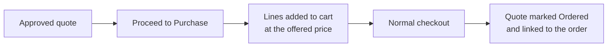

# Purchasing a Quote

Turning an approved quote into an order.

## What the customer does

1. **My Account → My Quotes**, open the approved quote.
2. Click **Proceed to Purchase**.
3. The lines are added to their shopping cart at the **offered price and quantity**.
4. They check out as normal.

Product options are replayed exactly as they were quoted, so a configurable bought from a quote
is the same variant that was quoted, and a bundle keeps its selections.

## Protecting the negotiated price

The negotiated price is applied as a custom price on the cart line, which sits below your
catalogue price and any tier pricing.

Whether discounts can then be stacked on top is up to
[Allow Discount on Quote Items](/configuration/button-and-cart):

| Setting | Behaviour |
|---|---|
| **No** (default) | Cart and catalogue price rules skip quoted lines. Other items in the same cart still get their discounts. |
| **Yes** | Quoted lines behave like any other line and rules apply on top. |

::: warning
With discounts allowed, a customer can combine a negotiated price with a coupon and pay less than
you agreed. Leave the setting off unless you specifically want that.
:::

## After the order is placed

When the order is saved, the quote is linked to it and closed:

- the quote's status becomes **Ordered**
- the order number and its status appear in My Quotes and in the admin grid
- the quote can no longer be purchased again

## Quotes that cannot be purchased

| Status | Why not |
|---|---|
| **Pending**, **Processing** | No offer has been made yet |
| **Declined** | You closed it |
| **Expired** | The offer lapsed — see [Workflow](/configuration/workflow) |
| **Ordered** | Already bought |

An expired quote is not lost. Set it back to **Approved** in admin and the customer can buy it
again.
