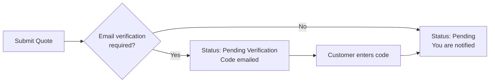

# The Quote Cart

The quote cart is where a shopper reviews what they have collected and sends the request. It is
separate from the shopping cart, and reached from the quote-cart icon in the header.

## What is on the page

**The items table** — one row per product, with:

| Column | Editable |
|---|---|
| Item | The product, its options, any custom-field answers, and a note |
| Price | Yes — the price they are asking for |
| Qty | Yes |
| Subtotal | Calculated |

Each row has **Update item** and **Remove item**. Below the table, **Clear Quote** empties it and
**Update Quote** saves all the edits at once.

**The summary panel** — the subtotal and quote total, then the details needed to send the
request:

- **Email Address**, **First Name** and **Last Name** — for guests only; signed-in customers are
  known already
- **Note** — a message covering the whole request
- **Attachments** — if you have [enabled them](/configuration/attachments)
- **Submit Quote**

## Sending the request

Clicking **Submit Quote** sends it. What happens next depends on your
[verification settings](/configuration/general):

Either way the shopper lands on a confirmation page showing their **quote request number** — the
reference for everything that follows.

## After submitting

The quote cart is now empty and the request has moved to **My Quotes** in the customer's account
(or, for a guest, to a link emailed to them). A shopper can start a new quote cart straight away;
the two do not interfere.

::: tip
The header quote-cart icon shows a live count and a dropdown listing what is in the cart with the
requested prices, so shoppers can check it from any page without navigating away.
:::
