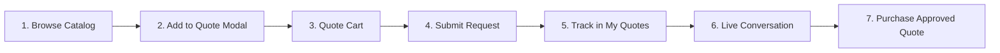

# Requesting a Quote

The Quote System allows shoppers to negotiate custom prices, volume discounts, or project rates directly from your Magento storefront.

---

## The Frontend Buyer Journey

Before looking at individual product actions, here is the complete end-to-end flow from the customer's perspective:

1. **Browse Catalog**: Shopper finds a quotable item on category or product detail pages.
2. **Add to Quote**: Shopper clicks "Add to Quote", configures variants, and enters target price and quantity in the popup modal.
3. **Review Quote Cart**: Shopper reviews all requested items, updates notes, and attaches documents.
4. **Submit Request**: Shopper submits the quote (with email OTP verification for guests if enabled).
5. **Track Status**: Buyer monitors progress under **My Account → My Quotes**.
6. **Negotiate**: Buyer and store admin exchange messages in the interactive conversation drawer.
7. **Purchase**: Once approved, buyer clicks **Proceed to Purchase** and checks out with the negotiated rates.

---

## Adding to Quote from the Product Page

1. Open any quotable product.
2. Configure required options (size, color, bundle options, or custom options).
3. Click the **Add to Quote** button next to Add to Cart.

4. The **Enter Quote Details** modal opens:

   | Field | Purpose |
   |---|---|
   | **Quantity** | The requested number of units (defaults to product page quantity) |
   | **Price per Item** | The target unit price proposed by the shopper |
   | **Note** | Line-item requirements, packaging requests, or project notes |
   | *Custom Form Fields* | Any custom dynamic fields configured by the admin (e.g. Delivery Date, Budget) |

5. Click **Submit**. The item is added to the customer's dedicated quote cart, and the header quote badge updates instantly.

The product's configured options travel with the quote request exactly as with a standard cart: a configurable product quoted as *Blue / Large* is quoted, approved, and purchased as *Blue / Large*.

::: tip Automatic Quantity Sync
The quote modal automatically inherits the quantity already selected on the product page, eliminating duplicate entries for volume buyers.
:::

---

## Adding from Category & Search Listings

- **Simple & Virtual Products** (with no required options) can be quoted directly from category grid cards — clicking **Add to Quote** opens the modal immediately over the listing.
- **Configurable, Bundle & Grouped Products** (which require variant selection) automatically guide the shopper to the product detail page to choose options first.

---

## Supported Product Types

| Product Type | Shopper Experience |
|---|---|
| **Simple / Virtual** | Single quantity, target unit price, and note. |
| **Downloadable** | Select downloadable links, then specify quantity and target price. |
| **Configurable** | Select variants (size, color, material), then submit quote details. |
| **Bundle** | Build bundle configuration; modal appears in the customization panel. |
| **Grouped** | Individual quantity, price, and note inputs for each child item in the group. |

---

## Validation & Constraints

The quote modal automatically validates:
- **Required Options**: Shopper must choose all mandatory product variants.
- **Minimum Quote Quantity**: Enforces the minimum item threshold set in [Product Display Configuration](/configuration/product-display).
- **Minimum Quote Subtotal**: Prevents submission if `Quantity × Price` is below the configured store minimum.

---

## Submitting the Quote

Adding items builds the quote cart. To review line items, upload project attachments, and send the proposal to store admins, continue to [The Quote Cart](/using/quote-cart).
