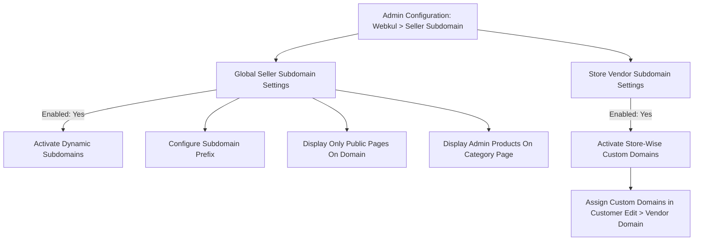

# Configuration

After successfully installing the module, the store administrator must verify the module license before enabling the seller subdomain functionality on the storefront. Once verified, the administrator can configure global subdomain routing, domain prefixes, public page isolation, and store-view specific domain settings.

---

## Module License Verification

Before the extension can be activated, the administrator must verify the license key. Navigate to **Stores > Configuration > Webkul > Module License** in your Magento Admin Panel.

1. Locate **Seller Subdomain** (alongside **Marketplace Multi Vendor**) in the **Licensed Modules** table.
2. Enter the valid **License Key** received with your purchase order.
3. Click the **Save & Verify** button to validate the key against Webkul's licensing server.
4. Once verified, the status indicator will update to a green **VERIFIED** badge.

::: note Mandatory Verification
The extension functionality requires a valid, verified license. The module cannot be enabled in system settings until the **Seller Subdomain** license status displays **VERIFIED**.
:::

---

## Marketplace Seller Profile Settings Check

Upon module installation, Magento automatically adjusts specific core marketplace settings to prevent URL rewriting collisions. Verify these settings under **Stores > Configuration > Marketplace > Seller Profile Page Settings**:

- **Rewrite Seller's Shop URL**: Must be set to **No**.
- **Allow to automatic create seller public URL on seller registration**: Must be set to **No**.

::: tip Why These Settings Matter
Because the **Seller Subdomain** extension dynamically manages routing and URL namespaces via custom subdomains, standard Magento URL rewrites for seller shop profiles are disabled to avoid conflicting route rewrites.
:::

---

## Seller Subdomain Module Settings

Navigate to **Stores > Configuration > Webkul > Seller Subdomain** to configure the core behavior of the extension.

---

## Global Seller Subdomain Settings

This group controls base subdomain generation across the marketplace instance:

### 1. Enabled
- Set to **Yes** to activate subdomain routing for marketplace sellers.
- Set to **No** to disable the module.
- *When set to Yes, additional configuration fields appear.*

### 2. Prefix
- Define a custom prefix string for the seller subdomain (e.g., `shop-` or `store-`).
- Allowed characters: lowercase letters (`a-z`), numbers (`0-9`), and hyphens (`-`).
- The seller's shop URL slug (chosen during registration) is appended to this prefix to form their unique subdomain (e.g., `prefix` + `shop_url` &rarr; `shop-gear-store.yourdomain.com`).

### 3. Display Only Seller's Public Pages On Seller's Domain
- **Yes**: Restricts the vendor subdomain exclusively to the four core seller public pages:
  - **Seller Profile** (`/`)
  - **Seller Product Collection** (`/collection`)
  - **Seller Feedback & Reviews** (`/feedback`)
  - **Seller Location** (`/location`)
  Any attempts by a visitor to navigate to non-seller pages (such as main store catalog or home) will redirect back to the primary store domain.
- **No**: Allows browsing standard store catalog, cart, and checkout directly under the seller's subdomain context (excluding marketplace landing pages and main storefront homepage).

### 4. Display Admin's Products On Category Page
- *Visible only when "Display Only Seller's Public Pages On Seller's Domain" is set to No.*
- **Yes**: Merges admin catalog products alongside the seller's products when browsing category and collection listings on the vendor subdomain.
- **No**: Exclusively displays the vendor's assigned catalog products.

---

## Store Vendor Subdomain Settings

This group enables mapping custom, independent domain names to sellers on a store-view basis:

### Enabled
- **Yes**: Allows administrators to assign dedicated external domain names (e.g., `https://womenstoreview2.vachak.com`) to individual sellers for specific store views.
- **No**: Uses standard subdomains generated via the global prefix setting.

::: note Domain Ownership Requirement
When **Store Vendor Subdomain Settings** is enabled, any custom domains assigned to sellers must be registered, active, and have their DNS A records pointing to your server IP address prior to being configured in Magento.
:::
