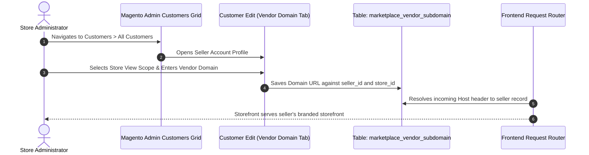

# Admin Domain Management

When the **Store Vendor Subdomain Setting** is enabled in system configuration, the store administrator has full capability to assign custom, independent domain names to individual marketplace sellers across specific store views.

---

## Accessing Seller Accounts

1. Log in to the Magento Admin Panel.
2. Navigate to **Customers > All Customers**.
3. Locate and select the marketplace seller whose domain settings you wish to configure, then click **Edit**.

---

## Configuring the Vendor Domain Tab

Upon opening the customer edit profile, an additional navigation tab titled **Vendor Domain** appears in the customer information menu:

1. Click on the **Vendor Domain** tab in the left rail.
2. In the **Vendor Domain** field, enter the fully qualified domain URL assigned to this seller (e.g., `https://womenstoreview2.vachak.com` or `https://seller-custom-brand.com`).
3. Click **Save Customer**.

---

## Store-View Specific Domain Allocation

The extension enables mapping different custom domains to the same seller depending on the active **Store View**. This allows multi-regional sellers to maintain distinct language- or country-specific domains (e.g., German store view vs English store view):

1. In the customer edit form, select the target **Store View** from the top-left scope switcher.
2. Enter the appropriate domain corresponding to that store view.
3. Save the customer record.

---

## Technical & DNS Prerequisites

Before binding custom domain names in the Magento Admin Panel, ensure:

- **Domain Ownership**: The domain name must be registered and active through an authorized domain registrar.
- **DNS A Record**: An `A` record pointing the custom domain to your Magento server's public IP address must be created and propagated.
- **Web Server Configuration**: The custom domain must be included in your web server's VirtualHost `ServerAlias` (Apache) or `server_name` (Nginx) directives.
- **SSL / TLS Certificate**: If serving traffic over HTTPS, ensure the SSL certificate covering the custom domain is active on the server.
