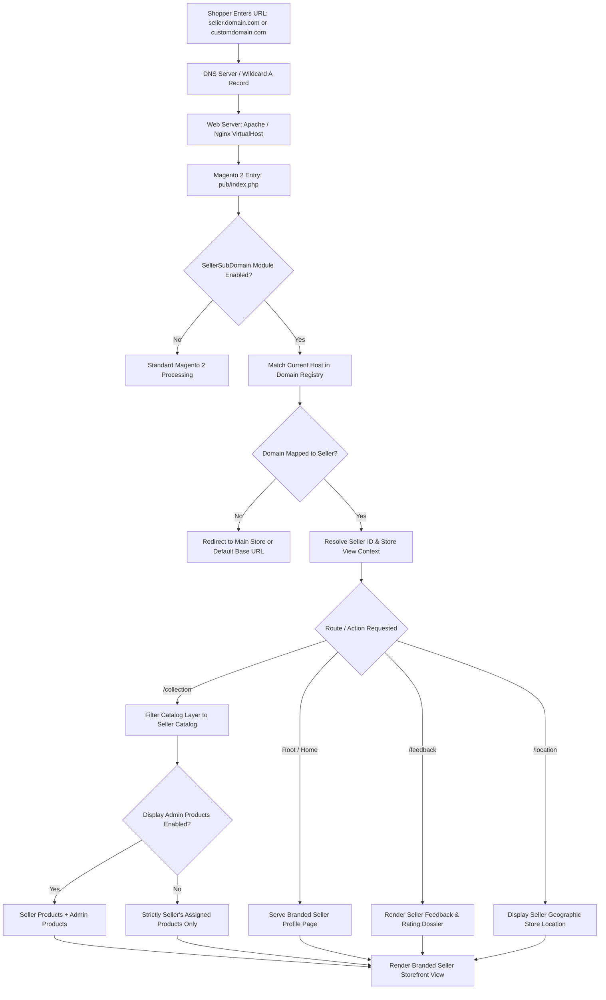

# Introduction

The **Webkul Magento 2 Marketplace Seller Subdomain** extension empowers multi-vendor store owners to assign unique branded subdomains (e.g., `https://seller1.example.com`) or completely independent domain names (e.g., `https://www.seller-store.com`) to individual marketplace sellers. This provides sellers with their own distinct online storefront presence while leveraging the centralized catalog, checkout, order management, and payment processing infrastructure of Magento 2.



---

## Key Highlights

- **Dedicated Subdomains for Sellers**: Automatically generates dedicated subdomains for registered sellers based on their shop URL token (e.g., `https://shop-gear-store.marketplace.com`).
- **Independent Custom Domain Support**: Store administrators can map custom top-level domains (e.g., `https://womenstoreview.com`) directly to specific seller accounts.
- **Store-View Specific Domain Assignment**: Admin can configure different domains for each seller according to the active store view, enabling localized multi-language and multi-currency seller branding.
- **Clean and Recognizable URLs**: Sellers receive intuitive, search-engine friendly URLs for their essential storefront pages (`/profile`, `/collection`, `/feedback`, `/location`).
- **Catalog Visibility Control**: Administrators can choose whether vendor subdomains display exclusively the seller's catalog or also incorporate admin products on catalog category views.
- **Restricted Public Page Enforcement**: Configurable isolation setting ensures only seller public pages are accessible on the vendor domain, redirecting disallowed endpoints back to the primary store.
- **Hyvä Theme Compatibility**: Seamlessly integrated with [Hyvä Theme](https://webkul.com/hyva-theme-development/) via companion module `Webkul_SellerSubDomainHyva` for ultra-fast Alpine.js storefronts.
- **Centralized Checkout & Administration**: Customers shop across branded vendor storefronts while checkout, cart items, payment gateways, and tax rules remain safely centralized on the parent Magento instance.
- **Open Architecture & Multilingual**: Supports complete language translation via CSV dictionary and adheres to Magento 2 modular architecture standards.

---

## Workflow at a Glance

1. **System & Server Configuration**: Configure DNS wildcard records (`*.example.com`) and update Apache or Nginx virtual hosts to route subdomain traffic to the Magento 2 root directory.
2. **Module Activation & Verification**: Validate the module license under **Stores > Configuration > Webkul > Module License** and activate **Seller Subdomain** in global settings.
3. **Subdomain Prefix Setup**: Set the global domain prefix. Registered seller shop tokens automatically combine with the prefix to form active subdomains.
4. **Custom Domain Allocation (Optional)**: If store-level custom domains are enabled, navigate to **Customers > All Customers**, select a seller, open the **Vendor Domain** tab, and assign custom domains per store view.
5. **Customer Browsing & Purchases**: Shoppers access the seller's branded domain directly to browse product collections, read reviews, inspect location maps, and complete orders.

```bash
php bin/magento setup:upgrade
```
<ExplainCode explanation="Registers Webkul_SellerSubDomain in app/etc/config.php and sets up the marketplace_vendor_subdomain database table." />

---

::: tip SEO and Brand Equity
By provisioning dedicated subdomains or custom domains for marketplace sellers, merchants can build distinct organic search footprints, run targeted marketing campaigns, and elevate vendor trust without incurring the operational cost of managing separate Magento 2 installations.
:::
