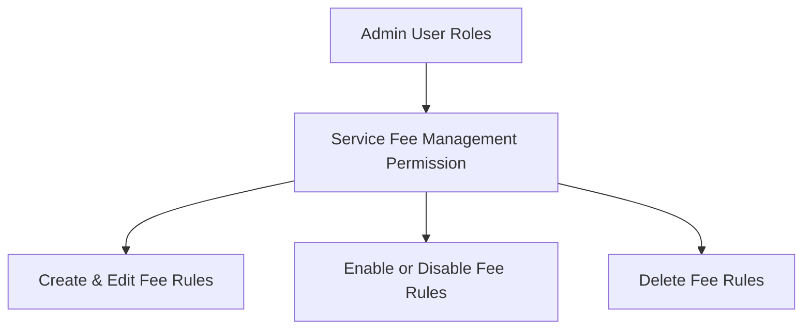

# Admin Configuration & Permissions

This guide explains how to enable the Service Fee module in your store settings and manage staff access permissions.

---

## Enabling the Module

To turn the Service Fee feature on or off globally:

1. Log into your Magento **Admin Panel**.
2. Navigate to:
   ::: tip Navigation Path
   **Stores** &rarr; **Settings** &rarr; **Configuration** &rarr; **Webkul** &rarr; **Service Fee**
   :::
3. Set **Enable Webkul Service Fees** to `Yes`.
4. Click **Save Config**.

| Setting Name | Option | Description |
| :--- | :--- | :--- |
| **Enable Webkul Service Fees** | `Yes` / `No` | Turn on to display service fees at checkout. Turn off to hide all extra fees. |

---

## Admin Staff Access Permissions (ACL)

If you have multiple staff members managing your Magento store, you can control who can manage service fees.

Navigate to:
::: tip Navigation Path
**System** &rarr; **Permissions** &rarr; **User Roles**
:::

- **Service Fee Management (`Create Service Fees`)**: Allows staff to view, create, edit, enable, disable, and delete service fee rules.
- **Support Access (`Support`)**: Allows staff to access Webkul help documentation and user guides.
- **System Configuration (`Config Service Fee`)**: Allows staff to toggle the global module on or off.

