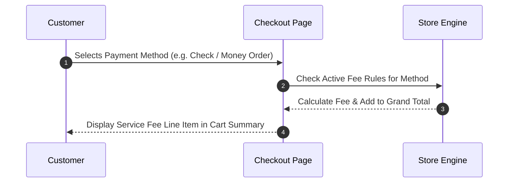

# Customer Checkout & Order Summary Flow

This guide explains how service fees appear to customers during checkout and how they carry over to store orders, invoices, and PDFs.

---

## 1. Customer Checkout Experience

When a customer shops on your store and reaches the payment step of checkout:

1. The customer selects their preferred payment method (e.g., *Check / Money Order*, *Credit Card*, or *PayPal*).
2. The order summary dynamically recalculates and displays the **Service Fees** line item under the order subtotal.
3. The grand total updates automatically to include the extra fee.

---

## 2. Admin Orders & Customer Confirmation Emails

Once the customer clicks **Place Order**:

- The Service Fee amount is recorded permanently on the order.
- Store managers can view the breakdown in **Sales > Orders** under the order totals section.
- The order confirmation email sent to the customer clearly itemizes the Service Fee line item.

---

## 3. Invoices & PDF Downloads

- **Invoices**: Creating an invoice in Magento automatically includes the service fee charge.

- **PDF Documents**: Printable PDF Invoices downloaded from the Admin Panel display a dedicated row for the Service Fee.

---

## 4. PayPal Integration Support

If your store accepts PayPal Express Checkout or PayPal Standard payments, the Service Fee extension automatically passes the fee as an itemized line item to PayPal. This prevents payment gateway errors where order totals mismatch.
