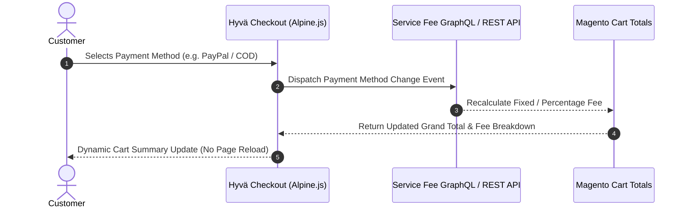

# Hyvä Theme Compatibility & Setup

The **Magento 2 Service Fee** extension by Webkul is fully compatible with **Hyvä Themes** (Alpine.js & Tailwind CSS), offering superior page load performance, fast checkout interaction, and a modern frontend user experience.

---

## Key Highlights of Hyvä Compatibility

- **Alpine.js Reactive Integration**: Dynamically updates service fee line items in the cart summary when customers switch payment methods without full page reloads.
- **Tailwind CSS Styling**: Pre-styled frontend components designed to blend seamlessly into Hyvä Theme designs.
- **Hyvä Checkout Support**: Works with Hyvä React/Alpine Checkout as well as standard Hyvä storefront layouts.
- **Unified Admin Management**: Admin configuration, rule creation, fixed/percentage fee calculations, and permissions remain 100% centralized in the Magento Admin Panel.

Hyva Default Checkout


Hyva One Page Checkout


---

## System Requirements for Hyvä

Before enabling Hyvä Theme compatibility, verify your environment meets the following requirements:

| Component | Minimum Version Requirement |
| :--- | :--- |
| **Magento Setup** | Magento / Adobe Commerce 2.4.x |
| **Hyvä Theme Core** | `hyva-themes/magento2-theme-module` 1.1.x or higher |
| **Hyvä Admin / License** | Valid Hyvä Theme License |
| **Webkul Core Module** | `Webkul_Base` and `Webkul_ServiceFee` |

---

## Installation & Setup

### 1. Install Hyvä Compatibility Extension

If your setup utilizes a separate Hyvä compatibility package, install it via Composer in your Magento 2 root directory:

```bash
composer require webkul/service-fee-hyva
```
<ExplainCode explanation="This command fetches and installs the Hyvä Theme compatibility module for the Service Fee extension." />

### 2. Enable & Deploy

Run the Magento deployment commands to enable the module and compile dependency injection:

```bash
php bin/magento setup:upgrade
```
<ExplainCode explanation="This command upgrades the database schema and registers the Hyvä Service Fee compatibility module." />

```bash
php bin/magento setup:di:compile
```
<ExplainCode explanation="This command compiles Magento code, dependency injection configurations, and Hyvä theme view models." />

```bash
php bin/magento cache:flush
```
<ExplainCode explanation="This command flushes all Magento cache storage types to apply frontend layout and template changes." />

### 3. Rebuild Tailwind CSS (Optional / Custom Theme)

If you are customizing frontend templates or class utilities within your active Hyvä theme, regenerate the compiled Tailwind CSS bundle:

```bash
cd vendor/hyva-themes/magento2-default-theme/web/tailwind
npm run build-prod
```
<ExplainCode explanation="Compiles Tailwind CSS classes used in Webkul Service Fee templates for production performance." />

---

## How Service Fees Function in Hyvä Checkout



---

## Verification & Testing

To verify that the Service Fee extension is functioning correctly on your Hyvä theme:

1. Open your frontend store in a browser.
2. Add a product to your shopping cart.
3. Proceed to the Hyvä Checkout payment step.
4. Select a payment method configured with an active Service Fee rule.
5. Confirm that the **Service Fees** line item displays cleanly in the cart summary order totals.
