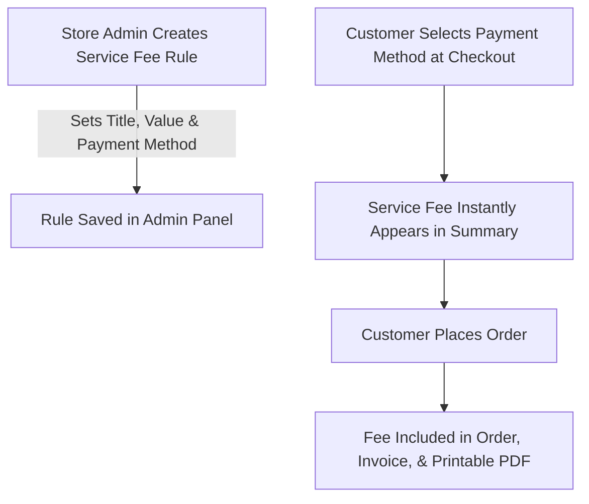

# Introduction

The **Magento 2 Service Fee** extension by Webkul enables store owners and e-commerce managers to easily add custom service charges—such as handling fees, processing surcharges, or packaging costs—to customer orders during checkout.

It is fully compatible with **Magento 2.4.x up to latest Magento Version** and supports **PHP 8.\* up to latest PHP Version**.

Whether you want to charge an extra fee for Cash on Delivery, add a processing fee for PayPal payments, or apply a fixed handling fee on all orders, this extension provides complete flexibility through the Magento Admin Panel.

---

## Key Benefits for Store Owners

- **Custom Fee Calculation**:
  - **Fixed Fee**: Charge a flat dollar amount (e.g., $5.00 extra handling fee).
  - **Percentage Fee**: Charge a percentage rate (e.g., 2.5% surcharge on cart subtotal).
- **Payment Method Flexibility**: Apply specific fees to individual payment methods (such as Credit Card, Cash on Delivery, or PayPal) or apply a fee universally to all payment options.
- **Transparent Checkout**: Customers see the exact service fee itemized in their order summary before completing payment.
- **Complete Order Synchronization**: Service fees appear as clear line items in Admin Orders, Invoices, and customer PDF downloads.
- **PayPal Payment Support**: Built-in compatibility ensures PayPal orders calculate totals accurately without amount mismatch errors.
- **Hyvä Theme Compatibility**: Native support for Hyvä Themes (Alpine.js & Tailwind CSS) for ultra-fast, high-performance checkout experiences.

---

## How It Works

---

## Quick Navigation

Get started with managing your service fees:

- Check system compatibility in [Requirements](/requirements.html).
- Follow step-by-step setup in [Installation Guide](/installation.html).
- Turn on the extension in [Module Activation](/activation.html).
- Set up administrative options in [Admin Configuration](/features/admin-configuration.html).
- Create your first fee rule in [Service Fee Management](/features/fee-management.html).
- Learn about checkout presentation in [Checkout & Order Flow](/features/checkout-order-flow.html).
- Configure Hyvä Theme support in [Hyvä Theme Compatibility](/features/hyva-theme.html).
