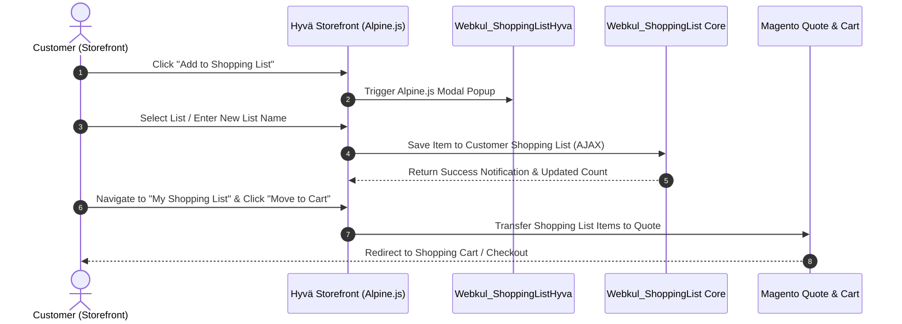

# Hyvä Theme Compatibility & Setup

The **Magento 2 Shopping List** extension by Webkul is fully compatible with **Hyvä Themes** (Alpine.js & Tailwind CSS). Through the `Webkul_ShoppingListHyva` compatibility module, it delivers lightning-fast page loading speeds, smooth interactive modals, responsive list management, and modern storefront user experiences without requiring full page reloads.

---

## Key Highlights of Hyvä Compatibility

- **Alpine.js Reactive Integration**: Instantly open list creation popups, select existing lists, dynamic item quantity updates, and seamless list transfers using lightweight Alpine.js state management.
- **Tailwind CSS Styling**: Utility-first storefront templates styled according to Hyvä design guidelines and responsive breakpoints.
- **Universal Product Support**: Fully supports Simple, Configurable, Downloadable, Grouped, and Bundle product types in Hyvä storefront views.
- **Product & Catalog Page Integration**: Includes "Add to Shopping List" action buttons on both Product Detail Pages (PDP) and Category Listing Pages (PLP) / Search Results.
- **Customer Account Dashboard**: Dedicated "My Shopping List" panel within the Hyvä customer account area for viewing, editing, and managing shopping lists.
- **Quick Order & Guest List Workflows**: Support for quick order item additions and guest user login prompts.
- **Centralized Admin Control**: All backend configuration settings, customer list management, and permissions remain fully centralized in Magento Admin.

---

## Storefront User Interfaces

### 1. Product Page "Add to Shopping List" Action & Modal

On the Product Detail Page (PDP), registered customers can click **Add to Shopping List** to open an Alpine.js modal popup. Customers can select an existing shopping list or create a new one on the fly.


---

### 2. Customer Account Shopping List Dashboard

In the customer account dashboard under **My Shopping List**, customers can manage their saved lists, update item quantities, remove items, or move an entire list into the shopping cart.


---

### 3. Catalog & Search Listing Integration

Category listing pages and catalog search results feature quick "Add to Shopping List" triggers for swift product organization.


---

## System Requirements for Hyvä

Before enabling Hyvä Theme compatibility, verify your environment meets the following requirements:

| Component | Minimum Version Requirement |
| :--- | :--- |
| **Magento Setup** | Magento / Adobe Commerce 2.4.x |
| **Hyvä Core Theme** | `hyva-themes/magento2-default-theme` 1.1.x or higher |
| **Hyvä Fallback Module** | `hyva-themes/magento2-compat-module-fallback` |
| **Webkul Core Modules** | `Webkul_Base` & `Webkul_ShoppingList` |
| **Webkul Hyvä Compatibility** | `Webkul_ShoppingListHyva` (`webkul/shopping-list-hyva`) |

---

## Installation & Setup

### 1. Install Hyvä Compatibility Module

If you are installing the module via Composer, execute:

```bash
composer require webkul/shopping-list-hyva
```
<ExplainCode explanation="This command fetches and installs the Hyvä Theme compatibility module for the Webkul Shopping List extension into your Magento 2 project." />

### 2. Enable & Deploy in Magento

Run standard Magento deployment commands to register the module and refresh dependency injection:

```bash
php bin/magento setup:upgrade
```
<ExplainCode explanation="This command updates database schemas, registers the Webkul_ShoppingListHyva module, and updates module statuses in app/etc/config.php." />

```bash
php bin/magento setup:di:compile
```
<ExplainCode explanation="This command compiles Magento dependency injection definitions, proxies, factories, and Hyvä theme view models for optimal performance." />

```bash
php bin/magento cache:flush
```
<ExplainCode explanation="This command flushes all Magento cache types to ensure layout XML additions, Alpine.js templates, and storefront views load immediately." />

### 3. Rebuild Tailwind CSS (Custom Hyvä Theme)

If you have customized Tailwind utility classes in your Hyvä theme, purge and rebuild the Tailwind CSS bundle:

```bash
cd vendor/hyva-themes/magento2-default-theme/web/tailwind
npm run build-prod
```
<ExplainCode explanation="This command compiles and purges utility classes used in Webkul Shopping List Hyvä templates into the theme's production Tailwind CSS bundle." />

---

## System Architecture & Workflow



---

## Verification & Testing

To verify that the Shopping List extension is functioning on your Hyvä theme:

1. Log in as a registered customer on your Hyvä storefront.
2. Open a Product Detail Page (PDP) or Category Listing Page (PLP).
3. Click the **Add to Shopping List** button and verify the Alpine.js modal popup opens smoothly.
4. Select a list or create a new list, then confirm the item is added.
5. Go to **My Account -> My Shopping List** and verify saved items, quantities, and list metadata.
6. Click **Add All to Cart** and ensure items are transferred into the active shopping cart quote.
