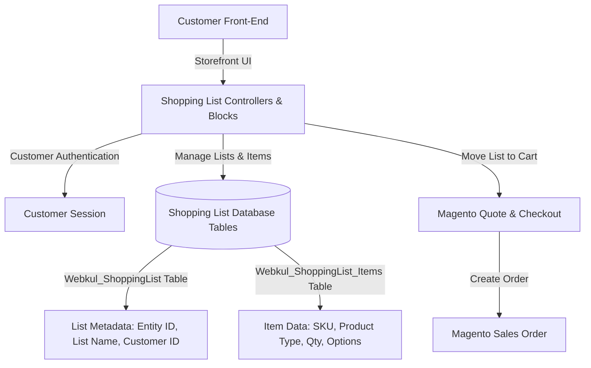

# Introduction

The **Webkul Magento 2 Shopping List** module (`Webkul_ShoppingList`) provides a powerful and flexible shopping list management system for Magento 2 / Adobe Commerce stores.

This extension enables registered customers to create, manage, and curate multiple custom shopping lists. Customers can quickly add items from product pages, update item quantities, and transfer an entire list directly into their shopping cart with one click.

---

## Overview Screenshot

---

## Key Features

- **Multiple Custom Shopping Lists**: Registered customers can create unlimited named shopping lists (e.g., *Monthly Groceries*, *Office Supplies*, *Wishlist 2026*) to organize their purchase plans.
- **Universal Product Type Support**: Fully supports all core Magento product types:
  - **Simple Products**
  - **Configurable Products** (with custom super attribute selections)
  - **Downloadable Products** (with specific link selections)
  - **Grouped Products** (with individual child product quantities)
  - **Bundle Products** (with custom bundle options and quantities)
- **One-Click Cart Transfer**: Move all products from a specific shopping list directly into the Magento shopping cart to streamline order creation.
- **Storefront Customer Panel**: Dedicated "My Shopping List" section in customer account dashboard with real-time list summaries, item counts, total prices, and direct list navigation.
- **Full Magento 2 Standard Compliance**: Built strictly adhering to Magento coding guidelines, dependency injection architecture, declarative schema, and caching standards.

---

## System Architecture Overview

---

## Next Steps

Explore the documentation to set up and configure your Shopping List module:

- Review [Requirements](./requirements.html) for store compatibility and dependencies.
- Follow [Installation Guide](./installation.html) for step-by-step module deployment.
- Activate the extension in [Activate the Module](./activation.html).
- Learn customer workflows in [Shopping List Workflows](./features/shopping-list-workflows.html).
- Set up Hyvä theme integration in [Hyvä Theme Compatibility](./features/hyva-theme.html).
