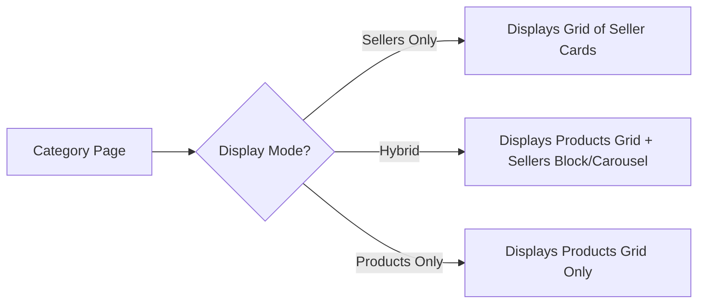

# Category Display Modes

This extension introduces two new display modes to standard Magento category configurations. Store owners can determine whether category pages show products, sellers, or a mix of both.

---

## Modifying Category Display Mode

1. In the Admin Panel, navigate to **Catalog > Categories**.
2. Select the category you wish to edit from the category tree.
3. Expand the **Display Settings** section.
4. Locate the **Display Mode** setting.
5. In addition to the default options (Products Only, Static Block Only, Static Block and Products), you will see the new modes:
   * **Sellers Only:** Displays only a list of marketplace sellers assigned to products in this category.
   * **Hybrid (Products & Sellers):** Displays both the default catalog products grid and a block of marketplace sellers.
6. Click **Save** and refresh the cache.

---

## Expected Storefront Behavior

### Sellers Only Mode
* The category page replaces the normal product listing with a grid of seller cards.
* Each card includes the seller's name, logo, rating, product count, and order count (based on admin configuration settings).
* Layered navigation is adjusted to display seller search and filter options.

### Hybrid (Products & Sellers) Mode
* Useful when customers want to browse specific products but also see who the top suppliers/sellers are for that category.
* Adds a dedicated seller section/carousel alongside the product catalog listing.

### Seller Quick View
* Customers can click the quick view trigger on any seller card to open an interactive modal containing seller info (banner, logo, ratings, location, etc.) and recent products without leaving the category page.
* Allows logged-in customers to follow or unfollow the seller directly from the quick view interface.

### Products Only Mode
* Reverts the category page to standard Magento storefront behavior, showing the default product catalog grid.
* No marketplace seller profile cards or custom layered navigation seller search/filters are rendered.

