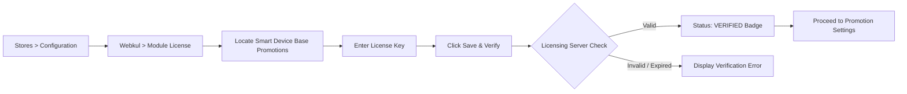
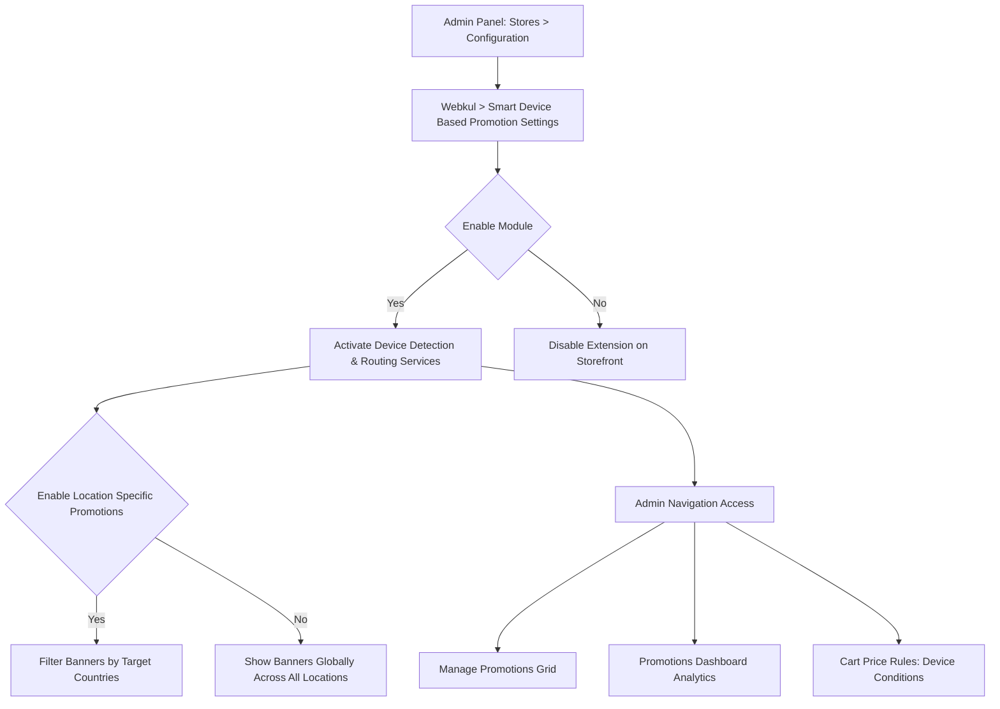

# Configuration

<!--
After successfully installing the extension, the store administrator must enable the module and configure general settings such as location-based targeting before creating promotional campaigns and device-specific cart price rules.
-->
After successfully installing the extension, the store administrator must verify the module license and configure general settings such as location-based targeting before creating promotional campaigns and device-specific cart price rules.

---

<!--
## Admin Configuration Settings

Modue licese verification

-->

## Module License Verification

Before utilizing the extension and activating device-targeted campaigns, the store administrator must verify the module license key. This validates your extension purchase against Webkul's licensing server and authorizes the module on your Magento 2 store instance.

Navigate to **Stores > Configuration > Webkul > Module License** in your Magento Admin Panel.

1. Locate **Smart Device Base Promotions** under the **Licensed Modules** table.
2. In the **License Key** field, enter the valid license key received with your purchase order.
3. Click the **Save & Verify** button to validate the key against Webkul's licensing server.
4. Once verified, the **Status** column updates to a green **VERIFIED** badge, and a confirmation message is displayed.
5. If you update your store domain, renew your license, or migrate environments, click **Re-verify** at any time to re-validate your license state.




::: note Mandatory License Verification
The extension functionality requires a valid, verified license. Ensure that the **Smart Device Base Promotions** license status displays **VERIFIED** before configuring and enabling promotional campaigns.
:::

---

## Admin Configuration Settings

To access the global settings for the module, navigate to **Stores > Configuration > Webkul > Smart Device Based Promotion Settings** in the Magento Admin Panel.




---

## Configuration Fields Breakdown

### 1. Enable Module
- **Yes**: Activates device detection on the storefront, enables device-specific promotional banners, applies device cart price rules, and tracks sales attribution by device.
- **No**: Completely deactivates the extension. Storefront pages render standard layouts without device filtering or smart promotions.

### 2. Enable Location Specific Promotions
- **Yes**: Enables country-level geolocation filtering. When active, promotional banners will only appear to customers browsing from countries selected within each individual promotion rule form.
- **No**: Ignores country restrictions and displays active promotional banners to all eligible visitors regardless of their geographic location.

Once you have completed setting these options, click **Save Config** in the upper-right corner.

---

## Admin Sidepanel Navigation

Administrators can also navigate to configuration settings and campaign management tools directly through the dedicated **Smart Device Based Promotions** section in the Magento Admin side menu:

1. Click on **Smart Device Based Promotions** in the left navigation sidebar.
2. Select one of the following menu items:
   - **Configuration**: Directly opens **Stores > Configuration > Smart Device Based Promotion Settings**.
   - **Manage Promotions**: Opens the promotional banner grid to create, edit, or delete banner rules.
   - **Promotions Dashboard**: Displays comprehensive sales and order performance analytics categorized by device type.


---

## Refreshing Cache After Configuration Changes

Whenever you modify settings under **Stores > Configuration**, refresh the Magento system cache to ensure your updates take effect immediately:

```bash
php bin/magento cache:flush
```
<ExplainCode explanation="Flushes Magento's configuration and full-page caches to apply updated promotion settings across the storefront." />

::: tip Production Best Practice
If your store uses Varnish Cache or a CDN such as Cloudflare or Fastly, ensure that device identification headers (or cookies) are properly whitelisted in your caching layer so that desktop and mobile visitors receive their respective cached variants.
:::
