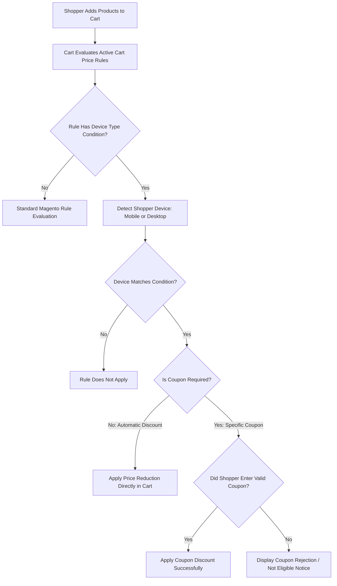

# Cart Price Rules

The **Webkul Magento 2 Smart Device Based Promotions** extension seamlessly integrates with Magento's native **Cart Price Rules** engine, introducing a dedicated **Device Type** attribute into rule conditions. This allows store administrators to grant automatic discounts or validate coupon codes exclusively based on whether a customer is shopping from a mobile or desktop device.

---

## Navigating to Cart Price Rules

1. Log in to the Magento Admin Panel.
2. In the left navigation menu, navigate to **Marketing > Promotions > Cart Price Rules**.

---

## Creating a Cart Price Rule

Click the **Add New Rule** button on the Cart Price Rules grid page to open the rule configuration form:

1. **Rule Name**: Enter a descriptive name for internal management (e.g., *Mobile Exclusive 15% Off* or *Desktop Checkout Promo*).
2. **Description**: Optional text describing the promotion terms.
3. **Active**: Set to **Yes** to enable the rule.
4. **Websites**: Select the websites where the rule should apply.
5. **Customer Groups**: Select eligible customer groups (e.g., *General*, *NOT LOGGED IN*, *Wholesale*).

---

## Device-Specific Discount Condition

To deliver **automatic discounts** that deduct instantly in the shopping cart without requiring shoppers to type a promo code:

1. In the **Rule Information** section, leave the **Coupon** dropdown set to **No Coupon**.
2. Scroll down and expand the **Conditions** tab.
3. Click the green `+` icon to add a new condition row.
4. From the condition dropdown list, select **Device Type** under the *Smart Device Based Promotions* group.
5. Click on the condition operator and choose **is**, then click on the value selector and choose either **Mobile** or **Desktop**.

6. Expand the **Actions** tab to specify the discount calculation:
   - **Apply**: Choose *Percent of product price discount*, *Fixed amount discount for whole cart*, or *Buy X get Y free*.
   - **Discount Amount**: Enter the discount percentage or value.
7. Click **Save** in the top navigation bar.

Shoppers accessing your store from the specified device type will automatically see the discount deducted from their cart subtotal during checkout.

---

## Device-Specific Coupon Application

Merchants frequently run multi-channel campaigns where promotional coupon codes (distributed via SMS marketing, email newsletters, or social media ads) must only be redeemable on a specific device.

### 1. Set Specific Coupon

In the **Rule Information** section:
- Set **Coupon** to **Specific Coupon**.
- Enter your desired **Coupon Code** (e.g., `MOBILESALE20` or `DESKDEAL10`) or check **Use Auto Generation** to batch-generate unique codes.
- Set **Uses per Coupon** and **Uses per Customer** as required.

### 2. Configure Device Restriction Condition

1. Navigate to the **Conditions** section of the rule form.
2. Add the condition: `Device Type is [Mobile / Desktop]`.

3. Under the **Actions** tab, define the discount value.
4. Save the rule.

---

## Storefront Validation Behavior

When a customer attempts to enter this coupon code on the storefront:
- **Eligible Device**: If the shopper applies the code on the matching device (e.g., entering `MOBILESALE20` while browsing on mobile Safari), the code is validated and the discount is deducted from the order summary.
- **Ineligible Device**: If a desktop visitor attempts to enter a mobile-only coupon code, Magento displays a notification indicating that the coupon code is not valid for their current device environment.

::: tip Strategy Tip: Driving App & Mobile Web Adoption
Use mobile-restricted coupon codes in SMS and Instagram campaigns to incentivize shoppers to complete orders directly on their smartphones, improving mobile conversion rates and user engagement.
:::
