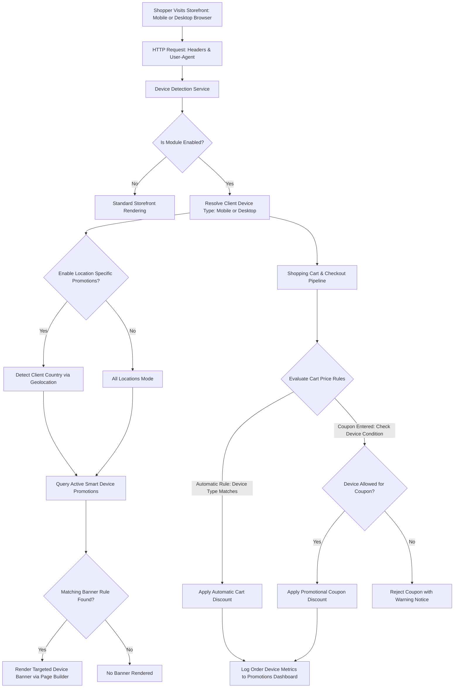

# Introduction

The **Webkul Magento 2 Smart Device Based Promotions** extension enables eCommerce store administrators to deliver tailored shopping experiences by identifying whether a visitor is browsing from a mobile device or a desktop computer. Store owners can design dynamic promotional banners, configure automatic cart price discounts, restrict promotional coupons to specific device types, and target offers to geographic locations.



---

## Key Highlights

- **Dynamic Device Detection**: Automatically recognizes whether a customer is browsing via a desktop web browser or a mobile device browser (smartphones and tablets) without requiring external third-party tracking cookies.
- **Device-Targeted Promotional Banners**: Create eye-catching promotional banners or popups tailored specifically for mobile screens or desktop viewports.
- **Page Builder Integration**: Craft rich, media-heavy banner layouts directly in the Magento Admin Panel utilizing Magento's integrated Page Builder tool.
- **Geolocation-Based Offer Targeting**: Restrict device-specific promotional banners to visitors from specific countries or open campaigns globally.
- **Automatic Cart Price Discounts**: Formulate Cart Price Rules that automatically deduct discount percentages or fixed amounts when a customer shops on an eligible device, requiring no promo code entry.
- **Device-Restricted Coupon Codes**: Generate coupon codes that can only be redeemed on a designated device type, driving mobile app/browser adoption or desktop-focused seasonal sales.
- **Real-Time Analytics Dashboard**: Monitor performance metrics including total sales generated via mobile devices, desktop browsers, and unknown user agents with monthly filtering.
- **Store View & Locale Flexibility**: Deploy promotions across specific store views and locales, with full support for RTL and LTR language translations.
- **Hyvä Theme Compatibility**: Fully compatible with modern [Hyvä Themes](https://webkul.com/hyva-theme-development/) via the companion package `Webkul_SmartDeviceBasePromotionsHyva`.

---

## Workflow at a Glance

1. **Module Activation**: Enable the extension and configure geolocation options under **Stores > Configuration > Webkul > Smart Device Based Promotion Settings**.
2. **Promotional Banner Configuration**: Navigate to **Smart Device Based Promotions > Manage Promotions** to create new campaigns specifying device type (Mobile/Desktop), Page Builder banner content, start/end schedules, priority, and country restrictions.
3. **Cart Price Rule Setup**: Under **Marketing > Promotions > Cart Price Rules**, add a new rule, open the **Conditions** tab, and specify `Device Type is Mobile` or `Desktop` to establish automatic discounts or coupon restrictions.
4. **Storefront Shopper Experience**: Shoppers browsing the storefront encounter device-appropriate banners and receive checkout discounts seamlessly based on their active browsing environment.
5. **Dashboard Analytics Review**: Navigate to **Smart Device Based Promotions > Promotions Dashboard** to analyze sales trends and campaign ROI across device categories.

```bash
php bin/magento setup:upgrade
```
<ExplainCode explanation="Registers Webkul_SmartDeviceBasePromotions in app/etc/config.php and sets up the promotion tables in the database." />

---

::: tip Omnichannel Campaign Optimization
By pairing mobile-exclusive discounts with mobile-optimized promotional banners, merchants can effectively incentivize on-the-go purchases, lower mobile cart abandonment rates, and optimize marketing spend across diverse customer touchpoints.
:::
