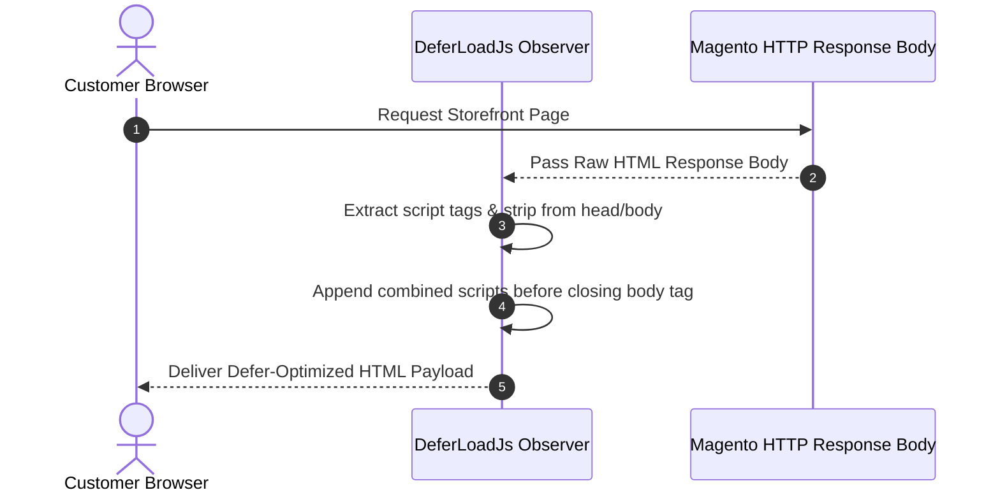

# Defer Load JS

**Defer Load JS** speeds up your store by displaying product images, text, and layout to customers instantly, while heavy background scripts load quietly behind the scenes.

---

## Why Use Defer Load JS?

**The Problem:**
When a customer opens your online store, their web browser reads your website code from top to bottom. By default, Magento 2 places heavy script files at the top of the page. This forces the browser to stop showing the page until all those script files finish loading — leaving shoppers staring at a blank white screen.

**The Solution:**
Enabling **Defer Load JS** moves non-essential scripts to the bottom of your page:
* **Instant Storefront View**: Shoppers see your store layout, banners, and product details right away.
* **Smooth Background Loading**: Interactive website scripts finish loading in the background after the page is already visible.
* **Better Google Speed Ranking**: Eliminates store slowness and boosts your store's Google PageSpeed ranking score.

## Admin Configuration

::: tip Admin Menu Location
Navigate to **Stores** &rarr; **Configuration** &rarr; **Webkul** &rarr; **Store Optimization Settings** &rarr; **Defer Load Js Settings**.
:::

::: note Defer Loading Concept
Defer loading means loading visual page content before JavaScript scripts. Loading page content first significantly increases store performance.
:::

| Setting | Field Type | Options | Description |
|---|---|---|---|
| **Enable Defer Loading** | Select | Yes / No | **Yes**: Page content loads before running external scripts to increase performance. **No**: Scripts load first in document head, decreasing performance. |

### Option Breakdown

* **Select "Yes"**: Page content will load completely before running any external script, significantly increasing storefront performance.
  

* **Select "No"**: External scripts will be included in the head, causing page rendering to wait and decreasing performance.
  

---

## Execution Flow

---

## Core Benefits

* Eliminates render-blocking JavaScript warnings in Google PageSpeed Insights.
* Speeds up First Contentful Paint (FCP) and Largest Contentful Paint (LCP).
* Prevents visual content flicker during page initialization.
