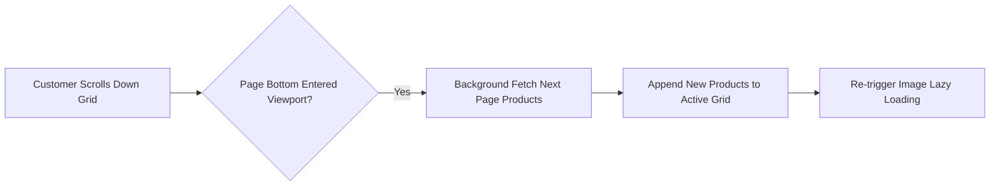

# Infinite Scroller

The **Infinite Scroller** feature converts traditional multi-page pagination into a continuous, seamless scrolling experience across catalog category listing pages and search result views.

Instead of requiring shoppers to click through numbered pagination links ("Page 1, 2, 3..."), upcoming products load automatically in the background as the customer scrolls down the page.

---

## Key Benefits

* **Frictionless Product Browsing**: Keeps shoppers engaged by eliminating full-page reloads and manual pagination clicks.
* **Higher Product Discovery & Conversions**: Allows customers to view your entire category catalog continuously on a single page, boosting session duration and sales.
* **Integrated WebP & Lazy Loading**: Newly loaded product cards automatically trigger image lazy loading and WebP compression for maximum storefront performance.

---

## Admin Configuration

Navigate to **Stores → Configuration → Webkul → Store Optimization Settings → Infinite Scroller**.

| Setting | Field Type | Options | Description |
|---|---|---|---|
| **Enable Infinite Scroller** | Select | Yes / No | **Yes**: Showcases all products on a single page as customer scrolls. **No**: Displays category products across multiple separate pages. |

### Option Breakdown

* **Select "Yes"**: The admin can enable the infinite scroller option by selecting **Yes**. This helps in showcasing all products available in a category on a single page.
  

* **Select "No"**: If the option is selected as **No**, the products on the category page will be visible to customers in multiple pages rather than on a single page.
  

---

## Storefront Integration

The Infinite Scroller applies to:
* **Category Product Grids** (`catalog_category_view`)
* **Quick Search Results** (`catalogsearch_result_index`)
* **Advanced Search Results** (`catalogsearch_advanced_result`)

